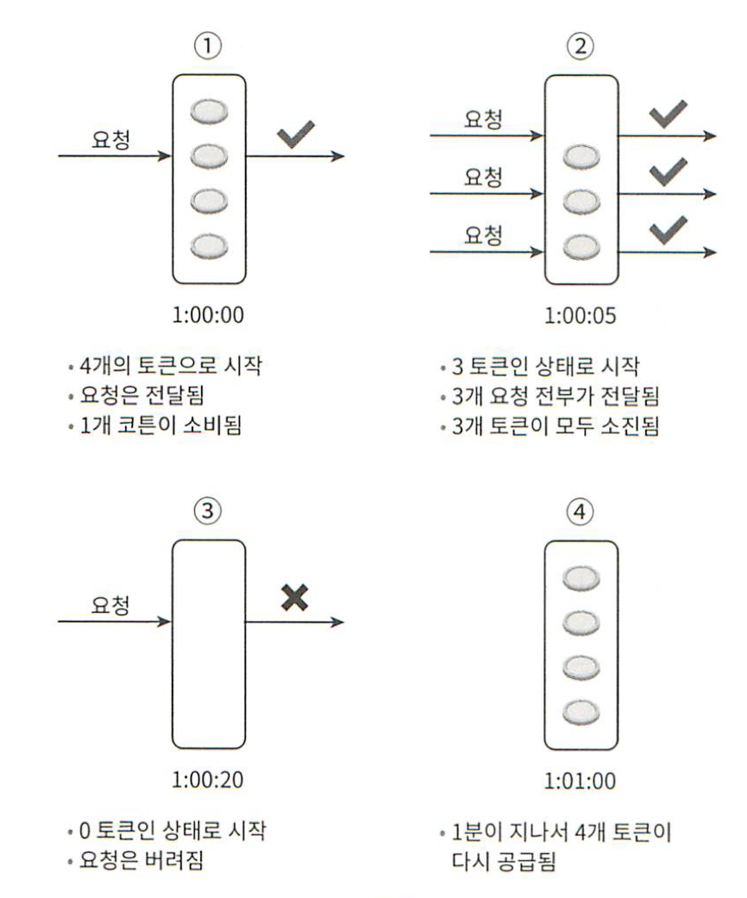
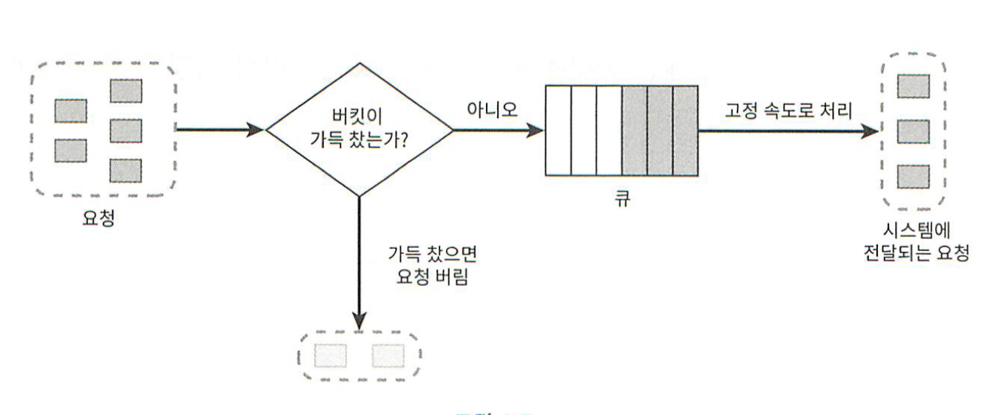
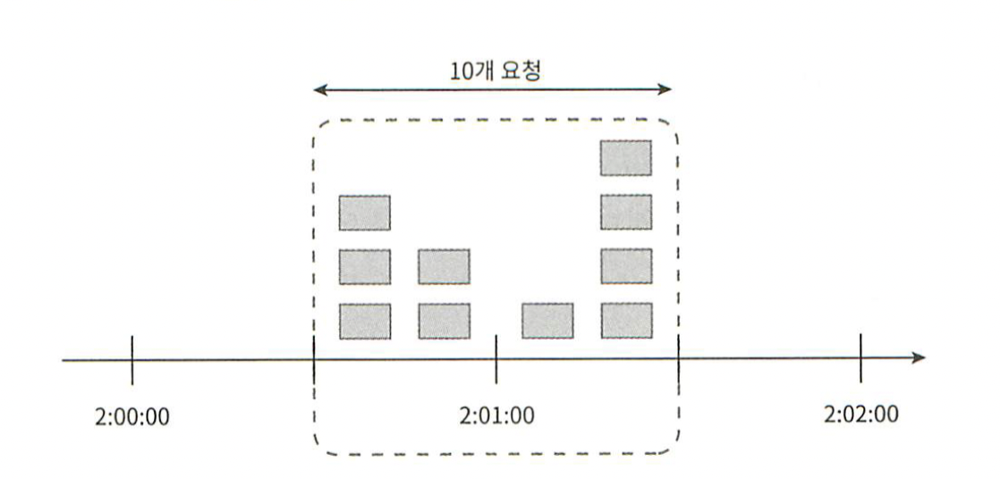
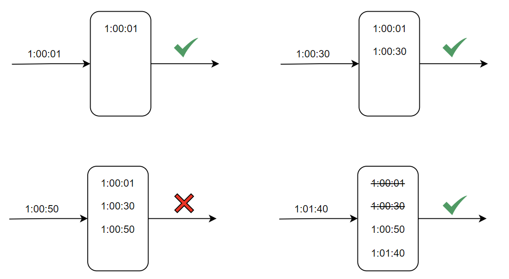
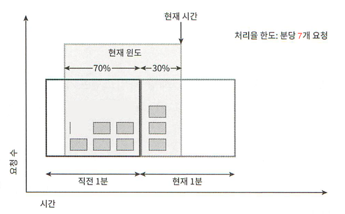
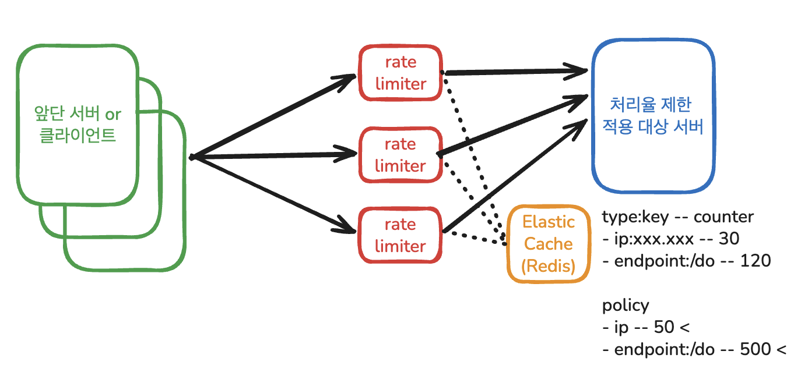
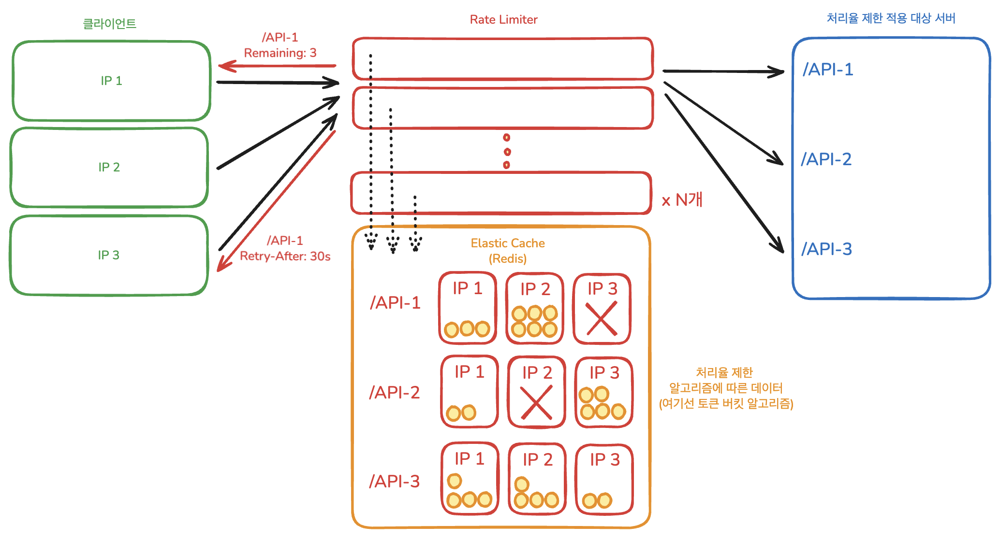
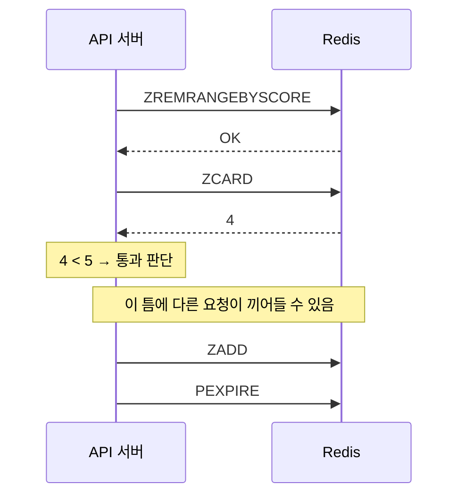
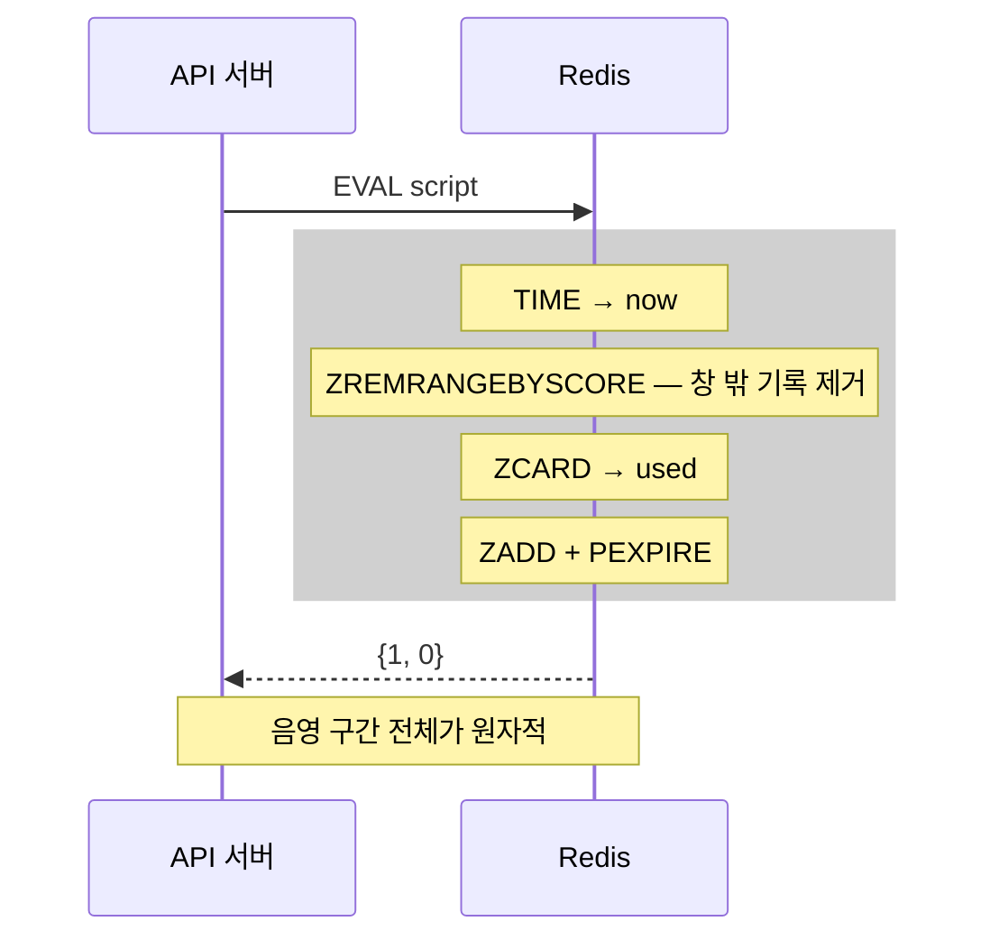

# **04장 - 처리율 제한 장치의 설계**

---

# 개요

## 처리율 제한 장치 `rate limiter`

- 네트워크 시스템에서 처리율 제한 장치`rate limiter`는 클라이언트 또는 서비스가 보내는 트래픽의 처리율`rate`를 제어하기 위한 장치
- API 요청 횟수가 제한 장치에 정의된 임계치`threshold`를 넘어서면 추가로 도달한 모든 호출에 대한 처리를 중단`block`한다.

## 사용 예시

- 사용자는 초당 2회 이상 새 글을 올릴 수 없다
- 같은 IP 주소로는 하루에 10개 이상의 계정을 생성할 수 없다
- 같은 디바이스로는 주당 5회 이상 리워드`reward` 를 요청할 수 없다

> Dos 공격에 의한 자원 고갈을 방지하고, 비용을 절감하며, 서버 과부하를 막는 처리율 제한 장치`rate limiter` 를 어떻게 설계하고 활용해야할지 알아보자!

---

# 본문

## 처리율 제한 알고리즘

### 1. **토큰 버킷 알고리즘**

> 버킷에 토큰을 담아두고 요청마다 소비하여 토큰 다 떨어지면 거절하는 방식



- 주기적으로 토큰을 버킷에 채워넣는 플로우가 있다. e.g., 1초에 토큰을 5개씩 넣으면 5 rps 제한
- 버킷은 목적에 따라 두는게 달라지는데, 엔드포인트 별로 버킷을 둘 수도 있고 유저/IP주소 버킷을 분리하여 둘 수도 있다.
- Pros: 구현이 쉽고 메모리 효율적이며, 짧은 시간에 갑자기 집중되는 burst of traffic 에도 효과적이다!
- Cons: 버킷 크기와 토큰 공급률이라는 두개 인자를 적절히 튜닝하는 것이 까다롭다.

### 2. **누출 버킷 알고리즘**

> 버킷 대신 큐를 사용해서 FIFO로 요청을 처리하는, 처리율이 고정된 상황에서의 방식



- 기본적으로 큐에 공간이 비어있으면 큐에 넣고, 꽉 찼으면 거절한다.
- 고정속도로 뒷단 시스템이 처리하면서 큐가 비고, 빈자리가 있으면 넣고 없으면 쳐냄
- Pros: 고정된 처리율을 갖고있가에 안정적 출력이 필요한 경우 적합하다.
- Cons: 단시간에 많은 트래픽이 몰라면 큐에 오래된 요청이 쌓이고 최신 요청이 버려지는 일이 발생한다. &amp; 토큰 버킷처럼 2개의 인자 튜닝이 까다롭다.

### 3. **고정 윈도우 카운터 알고리즘**

> 타임라인을 고정된 크기의 윈도우(1초, 1분 등)로 나누고 윈도우마다 카운터를 세는 방식



- Pros: 메모리 효율이 좋고, 직관적이라 이해하기 쉽다.
- Cons: 윈도우 경계 부근에 순간적으로 많은 트래픽이 집중될 경우 윈도우 할당 양보다 더 많은 요청이 처리될수 있다.

### 4. **이동 윈도우 로깅 알고리즘**

> 요청이 들어오면 타임스탬프를 로그에 찍고, 윈도우 안의 로그가 제한 개수 이하이면 요청을 처리하고 초과됐으면 로그만 남기고 요청 전달은 안하는 방식



- 일단 들어오면 로그는 남기고!
- 위 이미지 처럼 새로운 요청이 왔을때 시간축에서 윈도우 크기 전 보다 이전에 들어온 요청을 로그에서 삭제한다.
- 삭제 직후에 윈도우 내부 로그를 봐서, 제한보다 로그가 적냐 많냐에 따라 처리 여부를 결정한다.
- Pros: 메커니즘이 정교해서 어느 순간 윈도를 봐도 허용 요청개수가 처리율 한도를 안넘음
- Cons: 다만 다량의 메모리를 사용함. 거부된 요청의 타임스탬프도 보관하기에

### 5. **이동 윈도우 카운터 알고리즘** (슬라이딩 윈도우 카운터)

> 직전 윈도우가 슬라이드에서 차지하고있는 비율을 가중치 계산해서, 현재 읜도우에 쌓이고 있는 로그랑 더해서 요청량을 계산하는 방식



- Pros: 이전 시간대 평균 처리율에 따라 현재 윈도 상태를 조절해서 burst 트래픽에도 잘 대응함 + 메모리 효율이 좋다!
- Cons?: 직전 시간대 요청이 균등하다는 가정에서 추정치를 계산하기에 다소 느슨한데, 클라우드 플레어 실험에 따르면 오차는 0.003% 라고 한다.

## HTTP 헤더로 처리율 정보를 클라이언트에 전달하자

- `X-Ratelimit-Remaining`: 윈도우 내에 남은 처리가능 요청 수
- `X-Ratelimit-Limit`: 매 윈도마다 클라이언트가 전송할 수 있는 요청 수
- `X-Ratelimit-Retry-After`: 한도 제한에 걸리지 않기위해 몇 초 뒤에 요청 보낼지 알려주는 것

## 병렬 작업 환경에서의 문제

### Race Condition

- 가장 널리 알려진 해결책인 Lock을 쓰면 시스템 성능이 상당히 떨어질거다
- 대신 해결책이 2가지 있는데 하나는 Lua script이고 다른 하나는 레디스 자료구조인 정렬 집합 Sorted Set이다.

### 동기화 이슈

> 클라이언트도 여럿, 처리율 제한 장치도 여럿이라면

- sticky session으로 해결할 수도 있겠지만 추천하지 않는게, 규모면에서 확장 가능하지도 유연하지도 않다.
- 더 나은 해결책은 Redis 같은 중앙 집중형 데이터 저장소를 쓰는 것
- 제한 장치 간 데이터 동기화 시 최종 일관성 모델`eventual consistency model`을 사용해야한다.

---

# 설계

## 요구사항

- 서버 측 API를 위한 처리율 제한 장치를 설계해야 한다.
- 처리율 제한 장치가 HTTP **응답 시간**에 나쁜 영향을 주어서는 안된다.
- 시스템 규모는 **대규모 요청을 처리**할 수 있어야 한다.
- 시스템이 **분산 환경에서 동작**해야 한다.
- 제한 장치에 **장애가 생겨도 전체 시스템에 영향을 주어서는 안된다.**
- API 호출의 제한 기준은, **다양한 형태의 제어 규칙**`throttling rules` 을 정의할 수 있도록 하는 유연한 시스템 이여야 한다. (IP 주소, 사용자 ID 등)
- 예외 처리: 사용자의 요청이 처리율 제한 장치에 의해 걸러진 경우 사용자에게 그 사실을 분명히 알려야 한다.

## 1단계만 읽은 후 설계



- 분산 환경이니 처리율 제한기를 별도 모듈로 분리하고
- 중앙에 메모리 기반 공유 저장소에 저장 형태를 가변적인 제한 정책에 대응할 수 있도록 설정 + 메모리 저장소라 저 레이턴시 확보
- 제한 정책은 제어 서버에서 write through해서 메모리 저장소에 덮어씌우도록 함
- Per request로 메모리에서 읽고 메모리에 쓰고
- 고가용성을 위해 Rate Limiter 자체를 여러 태스크나 pod로 돌려서 일부 죽어도 가용성 보장되고 
- 다만 메모리 저장소가 죽으면 문젠데, 관리형 쓰자 - Elastic Cache
- DB에 타고 나르는건, 처리율 제한기는 실시간성이 목적에 따라 중요할 것이라 생각되어 메모리 기반이 맞다고 생각됨 디스크까지 싱크는 미고려

## 전부 읽은 후 설계



- 자원별, 타겟별로 처리율 제한이 분리되어야 한다.
- 중앙 메모리 기반 저장소는 정답이었다.
- 처리율 제한 알고리즘에 대응한 데이터 형식이여야 한다.
- HTTP 헤더를 통해 정보를 넘겨 클라이언트의 유연한 대응을 유도하자.
- 분산 환경에서의 동시성 제어는 필수적이다!

---

# 추가 리서치

## 락 대신 쓸 수 있는 해결책이 Lua 스크립트랑 Sorted Set이라던데 무슨 말일까?

### Lua script가 뭡니까?

- 1993년 개발된 매우 쉬운 깔끔한 문법의 가벼운 스크립트 언어
- Lua를 내포할 경우에 C/C++ 프로그램 개발 과정에서 리컴파일이나 리로딩없이 바로 설정 변화를 적용할 수 있게 되는 점 때문에 특히 게임업계에서 많이 쓰인다고 함

### Lua가 제공하는 원자성

- Redis는 명령 실행이 단일 스레드인데, 명령 하나에 대해서는 원자성을 보장함
- 근데 문제는 처리율 제한 로직 등은 읽은 값에 따라 다르게 행동해야 하기에, 그 분기를 클라이언트 단에서(Redis의 클라이언트니까 API 서버가 클라이언트) 돌리면 원자성이 깨짐
- Lua로 스크립트를 하나의 명령처럼 실행하면 분기 로직이 Redis 내부에서 놀아서, 스크립트가 도는 동안 다른 클라이언트의 명령이 끼어들지 못하게 됨

```Lua
-- KEYS[1]=키, ARGV[1]=한도, ARGV[2]=창 크기(초)
local current = tonumber(redis.call('GET', KEYS[1]) or 0)
if current >= tonumber(ARGV[1]) then
  return 0
end
redis.call('INCR', KEYS[1])
if current == 0 then
  redis.call('EXPIRE', KEYS[1], ARGV[2])
end
return 1
```

- 위 로직 실행을 위해 락 방식을 사용했다면 획득/읽기/쓰기/해제로 네트워크를 4번 오갈 걸 1번에 끝내는 것
- 다만 스크립트가 도는 동안 서버 전체가 멈추게되기에, 로직이 짧고 결정적이어야 하며
루프를 돌리면 안 됨

### 하필 Lua인 이유

- 언어 자체가 특별해서 라기보다 임베딩 조건에 맞아서
- 인터프리터가 100KB대로 작고, 샌드박싱이 쉽고, C에서 심어 넣기 편하고, 실행이 결정적임
- 그래서 결과적으로 Redis에 언어 하나 넣어야 했을 때 조건에 딱 맞는 게 Lua인 것

### Redis Sorted Set를 알아보자면

- Set에 원소마다 score(실수값) 를 붙이고, 그 score 순으로 정렬 상태를 항상 유지하는 자료 구조
- 원소(member)는 유일하고, score는 중복 가능. score가 같으면 member의 사전순으로 정렬됨
- 정렬을 조회할 때 하는게 아니라 삽입 시점에 유지하는 게 핵심이고, 그래서 범위 조회가 저렴함
- Redis 내부 접두사는 'Z'이고, ZSET으로 지칭함

### 내부 구조

- 해시 테이블 + 스킵 리스트 두 개를 같이 들고 있는 형태
- 해시 테이블은 member -&gt; score 조회를 O(1)으로 해주는 역할
- 스킵 리스트는 score순 정렬을 유지하고 범위/순위 조회를 O(log N)으로 만들어주는 역할

### 주요 명령과 시간 복잡도

| 명령                 | 하는 일           | 복잡도          |
| ------------------ | -------------- | ------------ |
| `ZADD`             | 원소 추가/score 갱신 | O(log N)     |
| `ZSCORE`           | 특정 원소의 score   | O(1)         |
| `ZCARD`            | 전체 개수          | O(1)         |
| `ZCOUNT min max`   | score 범위 안의 개수 | O(log N)     |
| `ZRANGEBYSCORE`    | score 범위 조회    | O(log N + M) |
| `ZREMRANGEBYSCORE` | score 범위 삭제    | O(log N + M) |
| `ZRANK`            | 원소의 순위         | O(log N)     |
| `ZINCRBY`          | score 증감       | O(log N)     |

---

# 적용 방안

## 논수리에 적용해보자

- 문제 상황: AI 채점이나 추천 기능에 대해 구글 계정별 제한은 DB 상에서 막아두었으나, IP에 대한 제한이 없다.
- 요구 사항: 타겟 리소스는 AI 채점 &amp; AI 추천 등 주요 엔드포인트로, IP별 사용 제한을 걸어두자! 계정 생성에 의한 무한 사용이 없게.
- 해결 방안: 이번에 나온 헷갈리는 개념을 최대한 활용해보자.
  - 중요 엔드포인트 4곳에 대해, IP 기반으로 시간당 최대 요청 횟수를 제한하자.
  - 처리율 제한 로직은 슬라이딩 윈도우 로그
  - Redis Sorted Set을 사용하고, Redis 내부에서 Lua 스크립트로 원자성을 보장하자.

## 슬라이딩 윈도우 로그 알고리즘에 ZSET을 쓰는 이유

### 슬라이딩 윈도우 로그 알고리즘이 요구하는 것

> 요청이 올 때마다 그 시각을 로그에 남기고, 지금부터 창 크기만큼 과거 구간 안의 로그 개수를 세야함
> 그렇기에 아래 3가지가 필요함

1. 시각들을 모아두는 곳
2. 창 밖으로 나간 시각을 버리는 수단
3. 창 안에 남은 개수를 세는 수단

> ZSET 자료구조가 정확히 이 3가지를 그대로 제공함!

| 알고리즘 개념      | ZSET에서      | 명령                                    |
| ------------ | ----------- | ------------------------------------- |
| 요청 로그(전체)    | ZSET 하나     | —                                     |
| 요청 하나의 타임스탬프 | score       | —                                     |
| 창 밖 기록 버리기   | score 범위 삭제 | `ZREMRANGEBYSCORE key 0 (now-window)` |
| 창 안 개수 세기    | 원소 수        | `ZCARD key`                           |
| 이번 요청 기록하기   | 원소 추가       | `ZADD key now uuid`                   |

### ZSET(Sorted Set)에는 뭐가 쌓임?

| 구성요소     | 담는 값             | 왜                                          |
| -------- | ---------------- | ------------------------------------------ |
| `key`    | `rl:<버킷>:<IP>`   | 엔드포인트별 한도와 IP별 창을 분리하는, 처리율 제한 대상이 되는 자원   |
| `score`  | 도착 시각 (epoch ms) | 이동 윈도우 로깅 알고리즘에서 로그 찍히는 시간. 요거 기준으로 삭제도 진행 |
| `member` | UUID             | 요청 하나를 세기 위한 자리표. 값 자체는 읽지 않고 사용하지 않음      |
| TTL      | 창 길이             | 특정 key에 해당하는 요청이 오랫동안 안오면 자연스레 청소되도록 하는 장치 |

### 저장되는 데이터를 예시로 보자면 (이해를 돕기위한 JSON이지 실제 JSON으로 저장되는거 아님)

```json
type: "zset"
key:"rl:ai-grade:1.2.3.4"
value: [ // members
  "0aac4155-6707-454b-bf6c-bd67f1b1d32c", "1787878330000", // {member, score}
  "4feba1f0-8cf7-4c00-9e86-6e1374a9ac86", "1787879433000",
  "d81d770a-91f0-4161-a2bf-dffc2b60ebb4", "1787880602000",
  "6fe9b30b-10d8-4b9e-bfbf-c929547d6abb", "1787881551000",
  ...
]
```

### 만약에 토큰 버킷 알고리즘이었으면 더 단순하고 필드도 단 2개만 유지하면 돼서 메모리 공간도 적게 차지함

```json
type: "hash"
key: "rl:ai-recommend:1.2.3.4"
value: [ // fields
  "tokens", "7.0000",    // ts 시점의 잔여 토큰 수
  "ts", "1787879924.551" // 위 잔량을 기록한 시간 (유닉스 초, 소수점은 마이크로초)
]
```

> tokens가 현재 시점 토큰 수는 아님. 이 값을 조회 시 통과하면 갱신하는 건 맞지만, 지속적으로 차는 토큰을 일일이 갱신하는 건 비효율적이기에, 조회가 들어왔을때 ts기반으로 충전 토큰량을 역산해서 tokens를 갱신함

## Lua 스크립트는 여기서 어떤 방식으로 쓰일까

### Lua가 Redis 안에서 하는 일

```lua
-- KEYS[1]=키, ARGV[1]=창 크기(ms), ARGV[2]=한도, ARGV[3]=요청 고유값
local window = tonumber(ARGV[1])
local limit  = tonumber(ARGV[2])
local t      = redis.call('TIME')
local now    = t[1] * 1000 + math.floor(t[2] / 1000)

redis.call('ZREMRANGEBYSCORE', KEYS[1], 0, now - window)
local used = redis.call('ZCARD', KEYS[1])
if used >= limit then
  local oldest = redis.call('ZRANGE', KEYS[1], 0, 0, 'WITHSCORES')
  local wait = math.ceil(tonumber(oldest[2]) + window - now)
  if wait < 1 then wait = 1 end
  return {0, wait}
end
redis.call('ZADD', KEYS[1], now, ARGV[3])
redis.call('PEXPIRE', KEYS[1], window)
return {1, 0} 
-- return {허용여부, 재시도까지 남은 ms}
```

> Redis가 이 스크립트를 중간에 다른 클라 명령을 끼우지 않고 실행함
> 위 스크립트를 순서대로 정리하면 아래와 같음

**1. `TIME`**

- 시각을 앱이 아니라 Redis에서 읽음

**2. `ZREMRANGEBYSCORE key 0 (now - window)`**

- 창 밖으로 나간 원소를 버림
- 멱등성 보장되는 로직이라 요청이 겹쳐 들어와도 됨

**3. `ZCARD key`**

- 창 안에 남은 개수. 이 값이 지금까지 쓴 횟수임
- 별도 카운터를 두지 않으므로 카운터와 실제 기록이 어긋날 자리가 없음

**4. `ZRANGE key 0 0 WITHSCORES` (한도 초과일 때만)**

- 가장 오래된 원소 하나를 꺼내 `그 시각 + 창 길이 - 지금`으로 자리가 비기까지 남은
ms를 계산해 돌려줌
- 최소 1로 깎아 0이나 음수가 넘어가지 않게 함

**5. `ZADD key now uuid` -&gt; `PEXPIRE key window` (통과일 때만)**

- 자리를 하나 차지하고 키의 수명을 창 길이로 다시 검
- 차단된 요청은 여기 도달하지 않기에 거부가 창을 더 채우지 않음
- 막힌 채로 계속 두드려도 해제 시각이 뒤로 밀리지 않게되는 것

### Lua 안쓰면 어캐되는디?

> **as-is -> 명령을 하나씩 보내고 클라이언트(API 서버)가 판단함**



> **to-be -> 스크립트 자체를 보내서 Redis가 판단함**



- as-is는 판단이 API 서버 메모리에서 일어나고, 값이 나갔다 돌아오는 동안 상태가 바뀔 수 있음
- 이 틈을 다른 방식으로 막으려면 분산 락이 필요해지고 왕복이 더 늘어남
- to-be는 판단이 데이터가 있는 곳에서 분기 판단이랑 처리가 일어나서 틈 자체가 안 생김
- 네트워크 왕복 또한 4번에서 1번으로 줄어서 그로인한 속도 자체가 빨라짐
