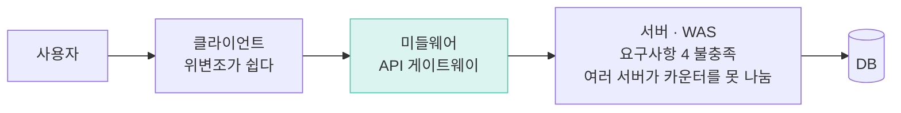
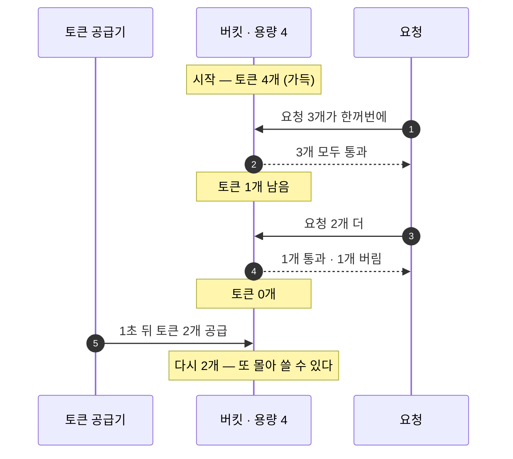
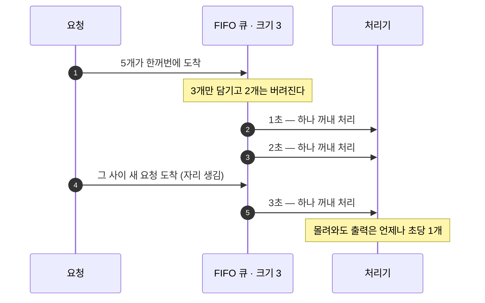

*NOTE << 요약자의 인사이트*
# 처리율 제한 장치 (Rate Limiter)
- 클라이언트 / 서비스가 보내는 트래픽의 처리율을 제어하기 위한 장치
- API 요청 횟수가 제한 장치에 정의된 임계치를 넘어서면 도달한 모든 호출은 처리가 중단

# 1단계 요구사항
1. 설정된 초과율을 초과하는 요청은 정확하게 제한
2. 처리율 제한 장치가 HTTP 응답 시간에 나쁜 영향을 주면 안됨
3. 가능한 한 적은 메모리
4. 하나의 처리율 제한 장치를 여러 서버/프로세스에 적용 가능
5. 요청이 제한되었을때는 그 사실을 사용자에게 분명히 전달
6. 제한 장치에 장애가 생겨도 시스템에 영향을 주어선 안됨.

# 2단계 개략적 설계안과 제시 및 동의 구하기
## 어디에 장치를 둘 것인가?
4가지의 선택지가 있다.
- 클라이언트 (Ex Web, Mobile)
	- 위변조가 쉬움
- 서버 (Ex WAS)
	- 상기 요구사항 4가 지켜지지 않음
- **미들웨어**
	- ex) API 게이트웨이


## 고려해야할 지점
- 현재 언어, 캐시 서비스 등 현재 사용하고 있는 기술스택 점검. 처리율 제한 장치를 서버에서 구현할만큼 효율이 높은가 검토.
- 알맞은 처리율 제한 알고리즘 채택. 다만 제 3자 제공 게이트웨이를 사용하기로 했다면 선택지 제한될 수 있음.
- 이미 API 게이트웨이를 두고 있다면, 해당 장치를 게이트웨이에 포함시켜야 할 수 있음.
- 직접 구현할 여력이 없다면 상용 게이트웨이를 쓰는 것이 바람직함.

## 처리율 제한 알고리즘
- 토큰 버킷
- 누출 버킷
- 고정 윈도 카운터
- 이동 윈도 로그
- 이동 윈도 카운터

### 토큰 버킷
토큰 버킷과 토큰 공급기로 구성.
- 토큰 버킷 : 지정된 용량을 갖는 컨테이너. 꽉 찬 버킷은 더 이상 토큰을 가질 수 없다.
- 토큰 공급기 : 설정된 토큰을 주기적으로 토큰 버킷에 공급함.

절차는 다음과 같다.
1. 요청이 도착하면 충분한 토큰이 있는지 검사한다.
2. 충분한 토큰이 있는 경우 버킷에서 토큰 하나를 꺼내고, 요청을 시스템에 전달.
3. 충분한 토큰이 없다면 해당 요청은 버려진다.


버킷은 재량껏 할당하면 된다.
- API 엔드포인트 별로
- IP 별
- 필요하다면 모든 요청이 하나의 버킷을 공유

장점 :
- 구현이 간단함
- 메모리 사용 측면에서도 효율적
- 짧은 시간에 집중되는 트래픽도 효율적으로 처리.

단점 :
- 버킷 크기와 토큰 공급률이라는 두 개 인자를 적절히 튜닝하는 것이 까다로움

적합한 시나리오 :
- 몰아 쓰는 것이 자연스러운 API — 화면 하나 열 때 요청 여럿이 동시에 나가는 경우
- 파일 여러 개 업로드, 목록 조회 후 상세 여러 건
- 평소엔 한가하다가 가끔 튀는 트래픽
- ex) AWS API Gateway 의 throttling

### 누출 버킷 알고리즘
토큰 버킷 알고리즘과 비슷하나, 요청 처리율이 고정되어 있다는 점이 다르다.
보통 FIFO 큐로 구현된다.

절차는 다음과 같다.
- 요청이 도착하면 큐가 가득 차있는지 확인. 빈자리가 있다면 큐에 요청 추가
- 큐가 가득 차 있다면 새 요청은 버림
- 지정된 시간마다 큐에서 요청을 꺼내어 처리.


장점 :
- 큐의 크기가 제한되어 있어 메모리 사용량 측면에서 효율적
- 고정된 처리율을 갖고 있기 때문에 안정적 출력이 필요한 경우 적합
단점 :
- 단시간에 많은 트래픽이 몰리는 경우 큐에는 오래된 요청들이 쌓이게 되고, 그 요청들을 제떄 처리 못하면 최신 요청들은 버려지게 됨.

적합한 시나리오 :
- 하류가 받을 수 있는 속도가 정해져 있을 때 — 내가 아니라 **상대가 한도를 정한 경우**
- 외부 API 호출 (그쪽이 초당 N 회만 받는다)
- 이메일·SMS·푸시 발송, 결제 게이트웨이 호출
- 배치 작업이 DB 를 때리는 속도 조절

### 고정 윈도 카운터 알고리즘
쉽게 말해 고정된 간격의 시간에 요청 임계치를 두는 방식.
절차는 다음과 같다.
- 타임라인을 고정된 간격의 윈도로 나누고, 각 윈도마다 카운터를 붙인다.
- 요청이 접수될때마다 이 카운터 값이 1씩 증가한다.
- 카운터 값이 임계치에 도달하면, 새로운 요청은 새 윈도가 열릴때까지 버려진다.

장점 :
- 메모리 효율이 좋다.
- 이해하기 쉽다.
- 특정한 트래픽 패턴을 처리하기에 적합
	- NOTE) 오히려 특정 시각에 폭증하는 트래픽을 의도적으로 받아줄 수 있다.
	- NOTE) 구독/과금 정책 단위로 사용 가능

단점 :
- 윈도 경계 부근에서 일시적으로 많은 트래픽이 몰려들면, 기대했던 시스템 처리 한도보다 많은 요청을 처리하게 됨.

적합한 시나리오 :
- 할당량이 **직관적인 시간 단위**로 정의될 때 — "하루 1,000회", "월 10만 건"
- 무료 티어 · 구독 등급별 사용량
- 화면에 "오늘 342 / 1000, 자정에 초기화" 를 보여줘야 할 때
- 일일 출석·보상처럼 칸이 곧 정책인 것

```mermaid
gantt
    title 한도 5회/분 인데 어떤 1분에는 10회가 통과한다
    dateFormat HH:mm:ss
    axisFormat %H:%M:%S
    todayMarker off

    section 고정 칸 (각자 한도를 지켰다)
    앞 칸 · 5회 — 뒤쪽 30초에 몰림 :done, a, 01:00:00, 1m
    뒤 칸 · 5회 — 앞쪽 30초에 몰림 :done, b, 01:01:00, 1m

    section 실제로 겪는 1분
    경계에 걸친 1분 · 10회 :crit, c, 01:00:30, 1m
```


### 이동 윈도 로깅 알고리즘
상기 고정 윈도 카운터 알고리즘의 단점을 해결한 알고리즘
**매 번 현재 윈도를 다시 정의한다고 생각하면 쉽다.**
예를 들어 1분이 윈도 크기라면, 현재 윈도는 {현재시각 - 60초} 가 된다.

절차는 다음과 같다.
- 요청의 타임스템프를 추적한다.
- 새 요청이 오면 만료된 타임스탬프는 제거한다.
	- 만료된 타임스탬프는 그 값이 현재 윈도의 시작 지점보다 오래된 타임스탬프를 말한다
- 새 요청의 타임스탬프를 로그에 추가한다.
- 로그의 크기가 허용치보다 같거나 작으면 요청을 시스템에 전달한다. 그렇지 않으면 처리를 거부한다.

```mermaid
gantt
    title 창이 매 요청마다 새로 그려진다 — 한도 3회 · 창 60초
    dateFormat HH:mm:ss
    axisFormat %H:%M:%S
    todayMarker off

    section 로그에 쌓인 요청
    1번째 :done, r1, 01:00:10, 2s
    2번째 :done, r2, 01:00:30, 2s
    3번째 :done, r3, 01:00:50, 2s
    4번째 — 거부 :crit, r4, 01:00:55, 2s
    5번째 — 통과 :active, r5, 01:01:12, 2s

    section 그때그때의 창
    4번째 요청 때 — 1·2·3 이 모두 안에 :crit, w1, 00:59:55, 1m
    5번째 요청 때 — 1번이 빠졌다 :active, w2, 01:00:12, 1m
```


장점 :
- 어느 순간의 윈도를 보더라도, 허용되는 요청 수는 시스템 처리율의 한도를 넘지 않음.
단점 :
- 메모리를 다량으로 사용. 거부된 요청도 기록하기 때문.
	- NOTE) 공격 받을 시에 메모리 폭증으로 이어질 수 있음.

NOTE) 거부된 요청도 기록한다는 점에서, 추후 발생할 요청에 기아가 발생 할 수 있다.
이는 정책에 따라 악의적인 추가 요청을 틀어막는 장치가 될 수도 있다.

적합한 시나리오 :
- **한도가 작고 정확해야** 하는 것 — 메모리를 쓰는 대신 한 건도 안 새게
- 로그인 시도, refresh token 갱신, 비밀번호 재설정, 결제 시도
- 정확한 `Retry-After` 를 줘야 할 때 (가장 오래된 로그 + 창 크기로 계산 가능)
- 한도가 크면 부적합 — 요청마다 타임스탬프가 쌓인다

### 이동 윈도 카운터 알고리즘
고정 윈도 카운터 알고리즘과 이동 윈도 로깅 알고리즘을 결합한 형태.

현 윈도의 요청 수를 계산하는 방법은 다음과 같다.
- 현재 1분 간의 요청 수 + 직전 1분간의 요청 수 * 이동 윈도와 직전 1분이 겹치는 비율

예시를 들겠다.

```mermaid
gantt
    title 한도 7회/분 · 지금은 01:01:18
    dateFormat HH:mm:ss
    axisFormat %H:%M:%S
    todayMarker off

    section 고정 칸
    직전 1분 · 5회        :done,   p, 01:00:00, 1m
    현재 1분 · 3회        :active, c, 01:01:00, 1m

    section 이동 윈도
    직전 칸과 겹침 70%    :crit,   w1, 01:00:18, 42s
    현재 칸 전부          :        w2, 01:01:00, 18s
```

장점 :
- 짧은 시간에 몰리는 트래픽에도 잘 대응
- 메모리 효율이 좋다
단점 :
- 직전 시간대에 도착한 요청이 균등하게 분포하고 있다고 가정한 상태에서 추정하기 때문에 다소 느슨
	- 다만 Cloudflare가 실시한 실험에 따르면, 실제 상태와 맞지 않는 요청은 40억 건 중 0.03%

적합한 시나리오 :
- **일반적인 API 처리율 제한의 기본값** — 정확도와 메모리의 절충
- 사용자 수가 많고 한도도 큰 경우 (저장하는 것이 숫자 두 개뿐)
- 고정 윈도의 경계 문제는 피하고 싶은데 로깅은 부담스러울 때

# 3단계 상세 설계
분산환경에서의 처리율 제한 장치 구현에서 생각해야할 것은 두개.
- 경쟁 조건
- 동기화

### 경쟁 조건
분산환경이 아니더라도 흔히 발생할 수 있는 상황.

해결책은 세 가지인데, 
- Lock 활용
	- 성능에 심각한 문제를 초래 할 수 있음
- Lua 스크립트 활용
- 정렬집합 사용

NOTE) Redis는 단일 스레드라 스레드 안전하지만, 처리기의 두 스레드가 같은 값을 보는건 막을 수 없다.
```
int newCount = counter.incrementAndGet();   // 원자적 (CAS)
if (newCount > limit) return REJECT;
```
이런 식으로 해결 해볼 수도 있을 것 같다.

### 동시성 이슈
다중 처리기를 사용하면, 처리기마다 상태가 달라 유저 요청 추가로 통과시키게 될 수 있다.

해결법은 두가지인데,
- 고정 세션 사용
	- 유저 요청을 항상 동일 처리기로 라우팅, 하지만 확장가능하지 않고 유연성도 떨어짐
- 중앙 집중형 데이터 저장소 사용
	- 처리기를 무상태로 만드는 방법

## 모니터링
처리율 제한 장치를 두었다면 반드시 데이터를 모아 모니터링 할 필요가 있다.
- 처리율 제한 알고리즘의 타당성
- 처리율 제한 규칙의 타당성
이 두 가지를 확인하기 위해서다.

이벤트, 마케팅 등 비즈니스 요구에 알맞는 알고리즘/규칙으로 전환 할 수도 있을 것이다.

