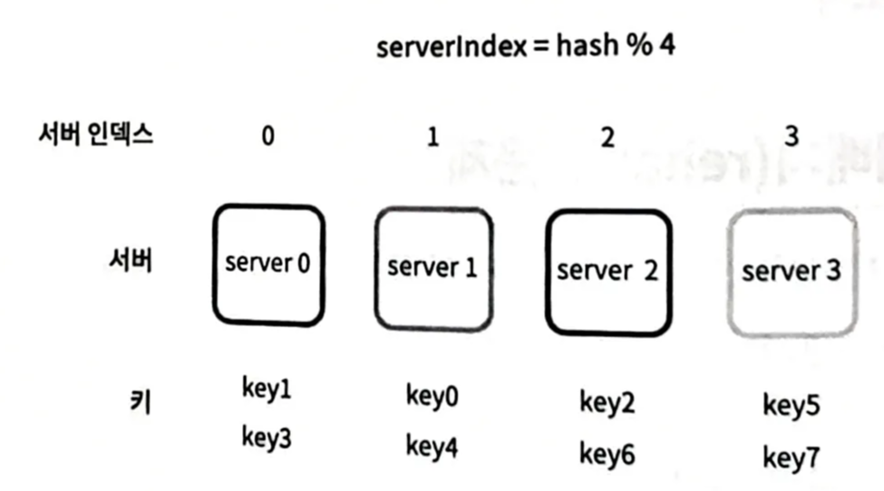
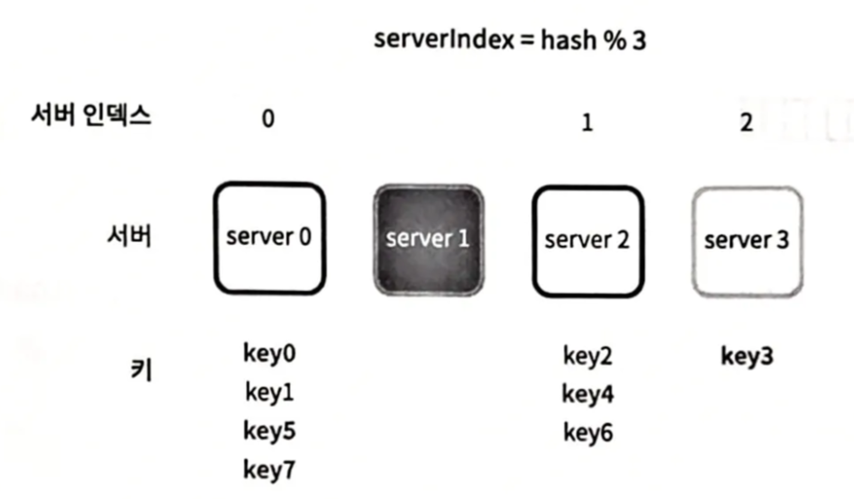
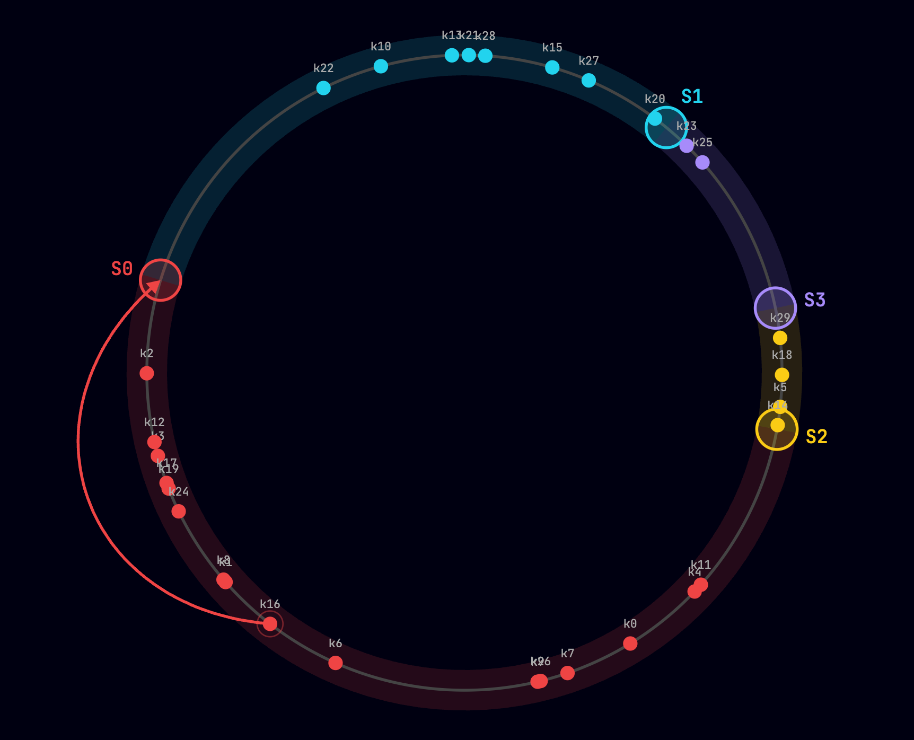

# [5장] 안정 해시 설계

# 개요

서버의 개수나 추가 / 제거에 따른 해시 키 재배치 문제에 대응하기 위한 안정적인 해시 설계 방법

# 본문

## 해시란?

> 임의 길이의 데이터 문자열을 입력으로 받아서 고정 크기의 출력, 일반적으로는 숫자와 문자열로 이루어진 해시 값 또는 해시 코드를 생성하는 수학적 함수
> 

동일한 입력은 항상 같은 해시 값을 반환한다.

이러한 특성을 이용해 암호화 또는 파일의 위변조 판정 등 다양한 용도로 활용한다.

수평적 규모 확장성을 달성하기 위해서는 요청 또는 데이터를 서버에 균등하게 나누는 것이 중요

이를 위해서 해시를 사용해 데이터를 분배

## 해시 키 재배치 문제

N개의 캐시 서버가 있다고 했을 때 각 서버들에 부하를 균등하게 나누는 보편적인 해시 함수는 아래와 같음

```
서버 인덱스 = hash(key) % N
*N = 서버의 개수*
```

이 방법은 서버 풀의 크기가 고정되어 있고, 데이터 분포가 균등할 때에는 잘 동작

하지만 서버 추가 또는 기존 서버 삭제 시 N 값이 변하기 때문에 이런 상황이 발생할 경우 대부분의 키가 재분배되는 문제 발생
**→ cache miss!!**





## 안정 해시

분산돼있는 서버 또는 서비스에 데이터를 균등하게 나누기 위한 기술

해시 테이블 크기가 조정될 때 평균적으로 오직 `k / n` 개의 키만 재배치
*k: 키의 개수, n: 슬롯(slot) = 서버의 개수*

**이하에 대한 설명은 시각적으로 표현한 자료를 통해 발표**

### 프로세스

1. 서버와 키를 균등 분포 해시 함수를 사용해 해시 링에 배치
2. 키의 위치에서 링을 시계 방향으로 탐색하다 만나는 최초의 서버가 키가 저장될 서버



### 문제점

- 서버가 추가 또는 삭제되는 상황을 감안하면 파티션의 크기를 균등하게 유지 불가능


기본 상태


S3가 제거된 상태

- 키를 균등하게 분포시키기 어려움


S0의 파티션이 커서 대부분의 키가 S0에 저장된 모습

### 가상 노드

실제 노드를 가르키는 가상의 논리적인 노드

하나의 노드는 여러 개의 가상 노드를 가질 수 있음


#### 장점

가상 노드의 개수를 늘리면 키의 분포가 균등해짐

#### 단점

해시 링에서 가상 노드에 대한 값을 저장하기 위한 공간이 추가로 필요

### 안정 해시의 장점

- 서버 추가 또는 삭제 시 재배치되는 키의 수가 적어짐
- 데이터가 보다 균등하게 분포됨 → 수평적 규모 확장에 용이
- 핫스팟(hotspot) 키 문제를 줄임
    - 핫스팟 키(hotspot key): 자주 조회되는 키
    ex. 유명인사의 데이터
    - 안정 해시는 데이터를 보다 균등하게 분배하기 때문에 이와 같은 문제를 줄임

# 적용 방안

WebSocket 연결 분배 및 어떤 서버에 연결되는지 조회 시 사용하기 용이해보인다.

WebSocket 연결은 기본적으로 한번 연결하면 계속 유지되며, 클라이언트의 연결과 끊김이 반복적으로 발생한다.

여러 대의 WebSocket 서버가 있는 경우, 클라이언트를 분배해서 각 서버에 연결하는 처리가 필요하다.

이 때, 안정 해시를 사용하면 재연결 비용을 최소화하며 WebSocket 서버의 추가 / 제거에 대응할 수 있다.

또한, 클라이언트 정보를 해시한 값만으로 해당 클라이언트가 어떤 서버에 연결되어 있는지 알기 쉽다.

# 생각해볼 점

- 해시 키 삽입 시 해시 값에 따라 시계 방향으로 탐색하며 해당 키가 삽입될 노드를 알게 되는데, 이에 따른 조회 오버헤드는 없는가?
- 가상 서버를 몇 개까지 두는 것이 유의미한 이득을 줄까?