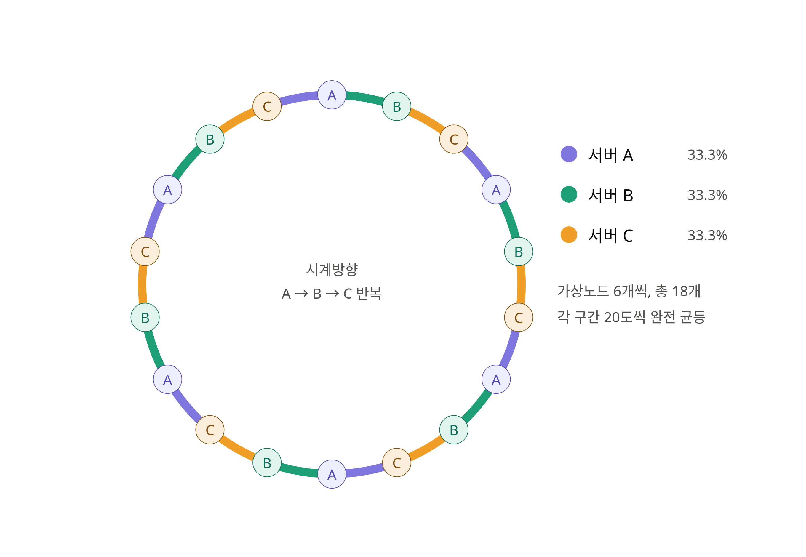
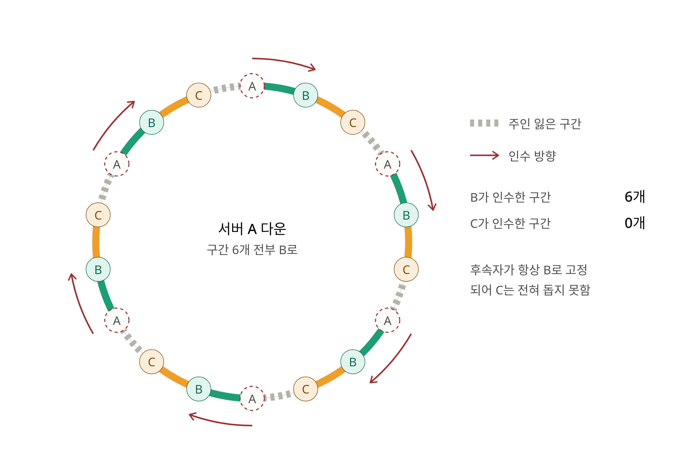
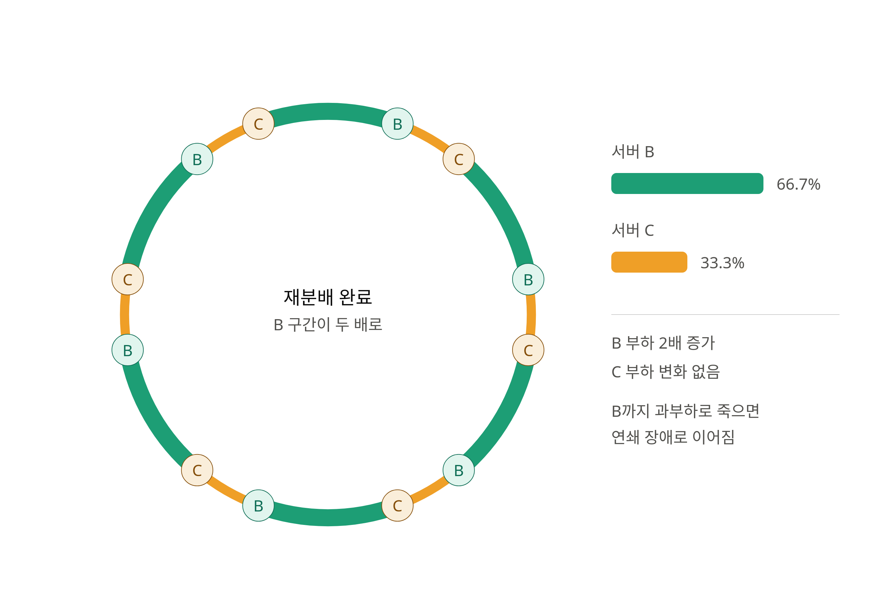

시계 방향인 것을 어떻게 구현할까요?
- 결국 숫자이기 때문에 바로 비교 가능 --> 이분탐색
가상 노드를 추가 했을 때 왜 분포가  균등해 지나요?
- 가상 노드는 논리적인 노드이므로  임의로 배치 가능. 파티션 구간을 최대한 짧게, 많게 만드는 것.
	- 링의 한 부분에 요청이 몰려 있는 경우, 가상 노드를 추가해서 분포를 고르게 한다는 것은 이상한 것 같습니다.
	- 해시 함수 자체가 요청을 고르게 분포시킬 수 있다고 가정하기에 전제가 이상하다.
- 규칙적으로 가상도느를 고르게 분포하면 다시 해싱 되는 구간을 최소화 할 수 있지 않을까?
	- 먼저 정상 상태입니다. 서버 3대에 가상노드 6개씩, 총 18개를 링 위에 `A → B → C` 순서로 규칙적으로 배치했습니다.
	- 
	- A 서버가 다운되면, A가 담당하던 6개 구간의 요청은 각각 **링에서 시계방향 바로 다음 노드**로 넘어갑니다. 배치가 `A B C` 반복이라 다음 노드는 예외 없이 전부 B입니다.
	- 
	- A가 빠지고 링이 안정된 뒤의 모습입니다. B의 각 가상노드가 담당하는 호(arc)가 원래의 두 배로 늘어난 반면, C의 호는 그대로입니다. 
	- 
안정 해시를 깎아 규칙을 더 만들어보면 더 균등하게 분포하게 할 수 있는 방법이 있지 않을까?