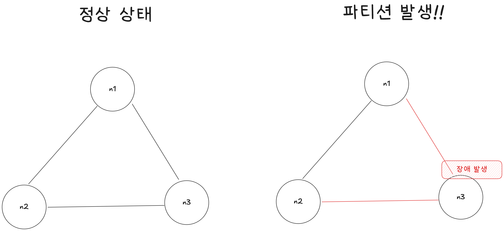
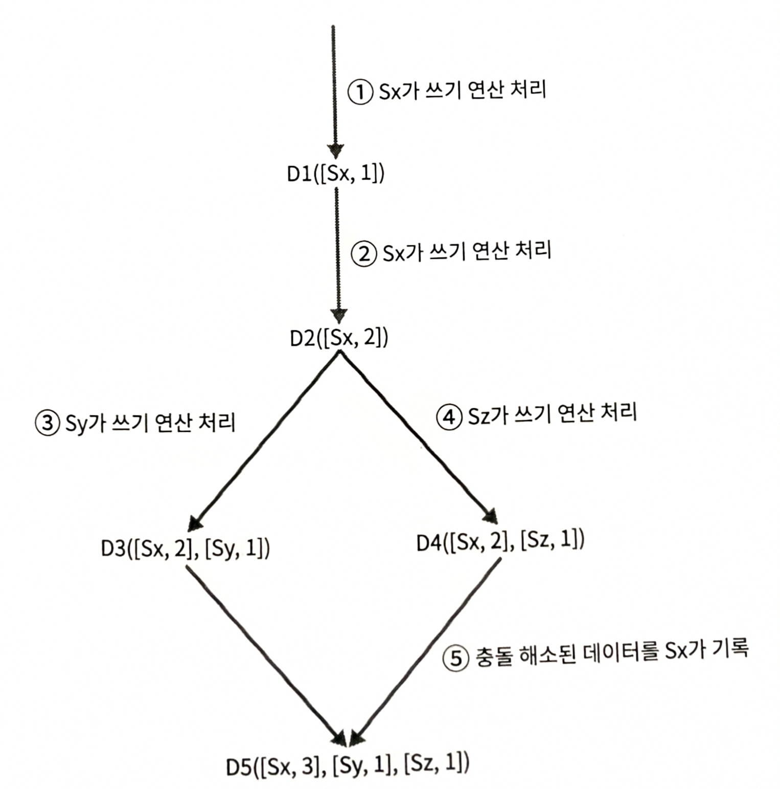
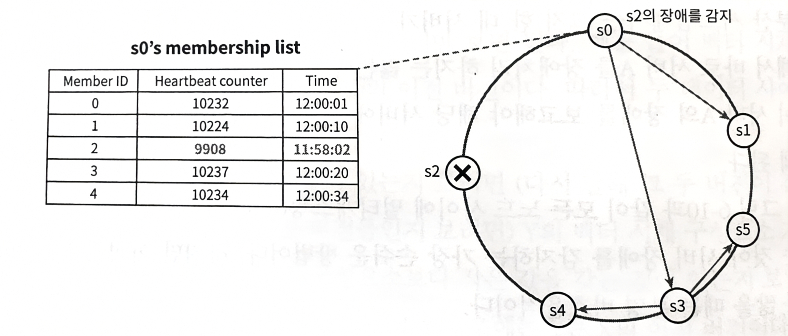
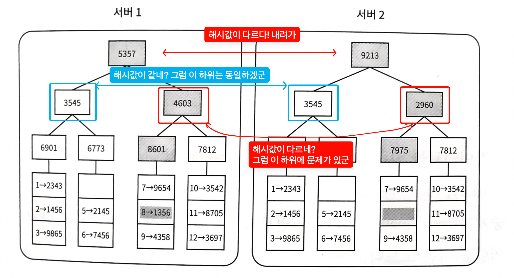

# [6장] 키-값 저장소 설계

# 개요

## `Key-Value` 저장소

- key를 통해 value을 조회하거나 저장할 수 있는 저장소
- 항상 key를 통해 value에 접근하므로 key를 관계형 데이터베이스에서의 PK(Primary Key)와 같이 사용

### Key

- 저장소 내에서 고유한 값
- 일반적으로 해시된 문자열 형태
- 성능상의 이유로 짧을수록 좋기 때문에 key를 해시하기도 함

### Value

- key와 pair를 맺어 저장되는 데이터
- 어떤 타입의 객체인지 무관 (ex. `string`, `list`, `object` , …)

## 분산 시스템

- 네트워크로 연결되어 있음
- 어떤 목표를 달성하기 위해 함께 동작하는 독립적인 컴퓨터들의 집합
- 데이터베이스에서는 데이터 가용성 및 확장성을 향상시키는 데 도움이 되기 때문에 사용

# 본문

## 단일 서버 키-값 저장소

그냥 key-value pair 전부를 메모리에 해시 테이블로 저장하면 됨 → **EASY~**

*~~무한대의 메모리랑 절대 죽지 않는 서버, 절대 죽지 않는 네트워크만 있으면 되잖어~~~*

**But. 이렇게 하면 속도는 빠르지만 모든 데이터를 메모리에 저장하는건 현실적으로 어려움**

→ 그나마 대안: 데이터 압축 / 자주 쓰이는 데이터만 메모리에 두고 나머지는 디스크에 저장

#### 그래서 필요한게 뭐다? → **분산 시스템**

## 분산 키-값 저장소

키-값 쌍을 여러 서버에 분산시키는 기술

→ 메모리가 부족하거나, 네트워크가 끊기거나, 노드가 죽거나 해도 ㄱㅊ

### CAP 정리

1. 데이터 일관성 (**C**onsistency)
    - 클라이언트는 어떤 노드에 접속했는지에 관계없이 항상 같은 데이터를 봐야 함
2. 가용성 (**A**vailability)
    - 클라이언트는 일부 노드에 장애가 발생했어도 항상 응답을 받을 수 있어야 함
3. 파티션 내성 (**P**artition tolerance)
    - 파티션이란?
        - 노드들 사이에 그룹으로 분리된 상태
        - 아래 예시에선 {n1, n2}, {n3} 그룹으로 나눌 수 있음
        - 파티션이 발생한 그룹끼리는 서로 그룹만 인지 가능
    - 여러 노드 집합 사이에 파티션이 생기더라도 시스템은 계속 동작해야 함
    - 책에서는 파티션 감내로 표현 → 뭔가 내성이 더 어울리지 않나??
    
    
    

CAP 정리: 데이터 일관성, 가용성, 파티션 내성 **세 가지를 모두 만족할 수 있는 설계는 불가능하다는 정리**


#### CP 시스템

일관성 + 파티션 내성을 지원하는 저장소 → 가용성 희생

하나의 노드라도 장애 발생 시 모든 노드의 읽기 / 쓰기 연산을 중지하면 최선의 일관성 확보 가능

- 은행권에서는 일관성 불일치가 매우 심각한 문제이기 때문에 이런 방식 사용

#### AP 시스템

가용성 + 파티션 내성을 지원하는 저장소 → 데이터 일관성 희생

낡은 데이터를 반환하더라도 그냥 고~

노드 하나에 장애가 있더라도 일단 읽고 쓸 수 있게 하고 나중에 장애난 노드만 고치자

#### CA 시스템

일관성 + 가용성을 지원하는 저장소

→ 파티션 내성을 지원하지 않음

**But. 분산 시스템에서는 네트워크가 필수인데 네트워크에 장애가 발생하지 않을 수는 없음**

**∴ 현실적으로 불가능한 시스템**

### 데이터 파티션

모든 데이터를 하나의 서버에 저장하는 것은 현실적으로 불가능 (메모리 용량, 네트워크 장애, 서버 장애, …)

그러면 어떻게 해야 하지??

→ 데이터를 분할하고 여러 서버에 저장하자

#### 고민해야 할 점

- 데이터를 여러 서버에 고르게 분산할 수 있는가
- 노드가 추가되거나 삭제될 때 데이터의 이동을 최소화할 수 있는가

key를 해시 링 위에 배치하고 그 지점으로부터 시계 방향으로 순회하다 만나는 서버에 저장

어 이거 어디서 봤던 것 같은데?? → 5장(안정 해시 설계) 참고


#### 장점

- 규모 확장 자동화: 시스템 부하에 따라 서버가 자동으로 추가되거나 삭제되도록 만들 수 있음
- 다양성: 각 서버의 용량에 맞게 가상 노드의 수 조정 가능
*~~니가 그렇게 용량이 커? 너가 더 가져가~~*

그런데 아직도 데이터가 한 서버에만 저장되잖아? 이러다 서버 죽으면??

### 데이터 다중화

데이터를 N개의 서버에 비동기적으로 다중화하는 기술

해시 링을 순회하면서 만나는 첫 N개 서버에 데이터 사본을 보관


가상 노드를 사용한다면 N개 노드를 선택할 때, 대응되는 물리적인 노드의 개수가 N보다 작아질 수 있음

→ 동일한 물리 서버를 중복 선택하지 않도록 하는 처리 필요

### 데이터 일관성

여러 노드에 다중화된 데이터는 적절히 동기화되어야 함

정족수 합의 프로토콜을 사용하면 읽기 / 쓰기 연산 모두 일관성 보장 가능

> **정족수 합의란?**

연산에 대해 N개의 노드에서 처리가 되면 성공, 그 이하면 실패
> 


- N = 사본 개수
- W = 쓰기 연산에 대한 정족수
- R = 읽기 연산에 대한 정족수

#### W, R 값에 따른 차이

- R = 1, W = N: 빠른 읽기 연산에 최적화
- R = N, W = 1: 빠른 쓰기 연산에 최적화
- W + R > N: 강한 일관성 보장 (보통 N = 3, W = R = 2)
- W + R ≤ N: 강한 일관성 보장 X

#### 일관성 모델

모델에 따라 데이터의 일관성 수준을 결정

- 강한 일관성: 모든 읽기 연산은 가장 최근에 갱신된 결과 반환
→ 클라이언트는 절대로 낡은 데이터를 볼 일이 없음
- 약한 일관성: 읽기 연산은 가장 최근에 갱신된 결과를 반환하지 못할 수도 있음
- 결과적 일관성: 약한 일관성의 한 형태로, 갱신 결과가 결국 모든 사본에 반영됨 = 동기화
    - 작동 방식
        1. 클라이언트가 데이터를 업데이트하면 이 업데이트는 비동기적으로 여러 복제본에 전파됨
        2. 업데이트는 즉시 모든 복제본에 적용 X, 네트워크 지연이나 노드의 상태에 따라 일정 시간 소요
        3. 동시에 여러 노드에서 업데이트가 발생할 경우, 충돌 해결 메커니즘을 통해 일관성 유지
        4. 시간이 지나면서 모든 복제본이 동일한 데이터를 가지게 되어 최종적인 일관성이 확보됨
    - 장점
        - 높은 가용성: 일부 노드가 실패하거나 네트워크가 일시적으로 분리되더라도 시스템 전체는 계속 동작
        - 확장성: 데이터가 여러 노드에 분산 저장되기 때문에 수평적 확장이 용이
        - 성능 향상: 데이터 접근이 로컬 복제본에서 이루어질 수 있어, 읽기 / 쓰기 연산 지연 시간 감소
    - 단점
        - 일시적 불일치: 사용자에게 일시적으로 최신 데이터가 반영되지 않을 수 있음
        - 복잡한 충돌 해결: 여러 노드에서 동시 업데이트가 발생할 경우 해결하기 위한 추가적인 로직 필요
        - 개발 복잡성 증가: 일관성 모델을 이해하고 이에 맞게 설계해야 함

**그럼 강한 일관성 모델이 무조건 좋은거 아니냐??**

강한 일관성을 달성하는 일반적인 방법은, 모든 사본에 현재 쓰기 연산의 결과가 반영될 때까지 해당 데이터에 대한 읽기 / 쓰기를 금지하는 것 → 응답속도 저하

#### 비일관성 해소 기법 → 데이터 버저닝

**데이터 일관성은 언제 깨질까?**

쓰기 요청이 여러 개의 클라이언트에서 서로 다른 데이터로 들어오면 발생


일반적인 조회 요청


쓰기 요청이 다른 데이터로 동시에 발생할 경우

**데이터 버저닝**

데이터를 변경할 때마다 해당 데이터의 새로운 버전을 만드는 것

#### 벡터 시계

- 데이터에 [서버, 버전]을 추가
- 추가한 [서버, 버전] 데이터를 통해 어떤 버전이 선 / 후행 버전인지 다른 버전과 충돌이 있는지 판별 가능
- 표현 방법: `D([S1, v1], [S2, v2], …, [Sn, vn])`
- 동작
    - 데이터 D를 서버에 기록할 때 시스템은 아래 작업 중 하나를 수행
        - [Si, vj] 가 있으면 vj를 증가
        - 없다면 새 항목 [Si, 1] 생성



백터 시계를 이용하면 쉽게 충돌이 발생했는지 알 수 있음

- 일반적인 쓰기 상황
    
    ```mermaid
    
    sequenceDiagram
        participant C as 클라이언트(서버)
        participant X as 저장소 X
        participant Y as 저장소 Y
    
        C->>X: 읽기(key)
        X-->>C: value="foo", clock={X:1, Y:0}
    
        C->>X: 쓰기(value="bar", context={X:1, Y:0})
        Note right of X: X 카운터 증가<br/>{X:1, Y:0} → {X:2, Y:0}
        X-->>C: 쓰기 성공, clock={X:2, Y:0}
    
        X->>Y: 복제(value="bar", clock={X:2, Y:0})
        Y-->>X: 복제 완료
    ```
    
- 충돌 발생 과정
    
    ```mermaid
    sequenceDiagram
        participant A as 클라이언트 A
        participant X as 저장소 X
        participant Y as 저장소 Y
        participant B as 클라이언트 B
    
        Note over X,Y: 초기 상태<br/>value="원본 내용"<br/>clock={X:1, Y:0}
    
        par 서로 다른 저장소에 쓰기
            A->>X: value="A가 수정한 내용"<br/>context={X:1, Y:0}
            X->>X: X 카운터 증가<br/>clock={X:2, Y:0}
            X-->>A: 쓰기 성공
        and
            B->>Y: value="B가 수정한 내용"<br/>context={X:1, Y:0}
            Y->>Y: Y 카운터 증가<br/>clock={X:1, Y:1}
            Y-->>B: 쓰기 성공
        end
    
        X->>Y: value="A가 수정한 내용"<br/>clock={X:2, Y:0}
        Y->>X: value="B가 수정한 내용"<br/>clock={X:1, Y:1}
    
        Note over X,Y: 어느 버전도 상대방의 변경을<br/>모두 포함하지 않음<br/>**→** 충돌로 판단
    ```
    
- 충돌 감지 과정
    
    ```mermaid
    sequenceDiagram
        participant C as 클라이언트 서버
        participant X as 저장소 X<br/>(중재자)
        participant Y as 저장소 Y
    
        C->>X: key="document" 읽기
    
        par 복제본별 버전 조회
            X->>X: 로컬 버전 확인
        and
            X->>Y: key="document" 버전 요청
            Y-->>X: value="B가 수정한 내용"<br/>clock={X:1, Y:1}
        end
    
        X->>X: 두 벡터 시계 비교
    
        Note right of X: 어느 버전도 상대 변경을<br/>모두 포함하지 않음 → 충돌
    
        X-->>C: 충돌한 두 버전 반환<br/><br/>1. value="A가 수정한 내용"<br/>clock={X:2, Y:0}<br/><br/>2. value="B가 수정한 내용"<br/>clock={X:1, Y:1}
    ```
    
- 충돌 해결 과정
    
    ```mermaid
    sequenceDiagram
    participant C as 클라이언트 서버
    participant X as 저장소 X<br/>(중재자)
    participant Y as 저장소 Y
    
    X-->>C: 충돌 버전 2개 반환<br/><br/>A 수정값 / {X:2, Y:0}<br/>B 수정값 / {X:1, Y:1}
    
    C->>C: 두 값을 병합<br/>value="A와 B를 반영한 내용"
    
    C->>X: 병합된 값 쓰기<br/>context={X:2, Y:1}
    
    X->>X: X 카운터 증가<br/>clock={X:3, Y:1}
    
    X->>Y: value="A와 B를 반영한 내용"<br/>clock={X:3, Y:1}
    
    X-->>C: 충돌 해결 완료
    ```
    
    감지까지는 저장소(중재자) 가 해도 무방하지만, 충돌 후 병합 과정은 애플리케이션 로직 → 클라이언트가 처리해야 함
    

두 개의 서버에 저장된 데이터가 다음과 같을 때

- 저장소 0에서 가져온 데이터: D([s0, 1], [s1, 1])
- 저장소 1에서 가져온 데이터: D([s0, 1], [s1, 2])

**→ 이건 s0에서 한번 쓰여지고 그 후에 s1에 두 번 쓰여진 데이터다~ → 충돌 발생 안했네**

그런데 이걸 가지고 어떻게 두 버전 사이에 충돌이 발생했는지 판별하냐? 

- 저장소 0에서 가져온 데이터: D([s0, 1], [s1, 2])
- 저장소 1에서 가져온 데이터: D([s0, 2], [s1, 1])

**→ 둘이 말하는게 달라 → 충돌 발생!!**

따라서, 충돌 발생 여부는 다음 조건으로 알 수 있음

저장소 N에서 가져온 데이터를 D(N), D(N)의 벡터 시계를 V(N) 이라고 표기할 경우

- 충돌 발생 X: V(Y)와 V(X)의 모든 값끼리 비교했을 때 V(Y)의 값이 전부 같거나 크다? → 그럼 D(Y) 가 더 최신 데이터
- 충돌 발생 O: V(Y)와 V(X)의 모든 값끼리 비교했을 때 V(X)의 데이터가 더 큰게 있다? → 충돌

**단점**

- 클라이언트에 충돌 감지 및 해소 로직이 들어가야 함
    - 여기서 말하는 클라이언트는 우리가 주로 생각하는 클라이언트가 아니라,
    키-값 저장소를 사용하는 서버가 될 수 있음
- 벡터 시계 데이터 저장을 위한 추가 데이터가 매우 빠르게 쌓임
    - 길이에 대해 임계치를 설정해서 일정 길이까지만 유지하는 방법
    - 버전 간 선후 관계가 정확하지 않게 되지만, 다이나모 데이터베이스에 따르면 이로 인한 문제가 발생한 적이 없다고 함

### 장애 감지 및 처리

#### 장애 감지

하나의 서버에서 다른 서버가 죽었다고 바로 장애 처리를 하지 않음

→ 두 대 이상의 서버가 동일하게 특정 서버의 장애를 보고해야 해당 서버에 실제로 장애가 발생했다고 간주

**대표적인 장애 감지 솔루션 → 가십 프로토콜**



소문(gossip) 과 같이 “난 살아있고 내가 가지고 있는 데이터는 ~~이야”를 전파해서 서버의 장애를 감지

각 서버는 멤버십 목록을 가지고 있다.

멤버십 목록: 해시 링으로 연결되어 있는 각 서버의 heartbeat counter 과 마지막으로 갱신된 시간

**프로세스**

1. 각 노드는 주기적으로 자신의 heartbeat counter 를 증가시킴
2. 무작위로 선정된 다른 노드들에게 자신의 heartbeat counter 목록을 전달
3. 특정 멤버(노드)의 카운터 값이 일정 시간동안 갱신되지 않았다면 해당 멤버에 장애가 발생한 것으로 간주

#### 장애 처리

**일시적 장애 처리**

- 엄격한 정족수를 사용하는 모델의 경우: 장애가 해소될 때까지 모든 노드의 Read / Write 제한 → 일관성 확보
- 느슨한 정족수를 사용하는 모델의 경우
    1. 살아있는 서버 중 쓰기 연산을 수행할 W개의 서버 / 읽기 연산을 수행할 R개의 서버 선택
    2. 장애가 발생한 서버가 처리해야 됐을 데이터를 임시로 다른 노드가 담당 + 그에 관한 단서 기록
    3. 죽은 서버가 살아나면 임시로 처리를 담당했던 노드가 본인이 처리했던 데이터를 인계


**영구 장애 처리**

- 반-엔트로피(anti-entropy) 프로토콜을 사용해 사본 동기화
- 사본 간의 일관성이 망가진 상태 탐지 + 동기화에 필요한 데이터 전송량을 줄임
- 머클 트리 = 해시 트리를 사용

1. 키 공간을 버킷 단위로 분할
    
    .jpg)
    
    *8번 데이터가 잘못되었을 경우*
    
2. 버킷에 포함된 각 키에 균등 분포 해시 함수 적용 → 각 키의 해시값 계산
    
    .jpg)
    
3. 버킷별로 해시값을 계산해서 해당 해시 값을 레이블로 갖는 노드 생성
    
    .jpg)
    
4. 자식 노드의 레이블로부터 새로운 해시 값을 계산해 이진 트리를 상향식으로 구성
    
    .jpg)
    
5. 두 해시 트리를 루트 노드의 해시값부터 비교
    - 해시값이 같다? → 두 서버는 같은 데이터를 가진다.
    - 하양식으로 내려가다 해시값이 다르다? → 그 부분부터 데이터가 다른 하위 부분이 있다.
    
    
    
    - 이 과정을 반복해서 데이터가 다른 부분만 동기화
    - 이론적인 해시 트리에서는 리프 노드는 데이터 그 자체가 되지만 현실적으로는 버킷 단위까지만 함

---

### 쓰기 경로

쓰기 요청이 키-값 저장소에 전달되면 어떻게 될까


1. 쓰기 요청을 커밋 로그 파일에 저장
(postgres의 WAL(Write-Ahead Log)와 유사, **쓰기 전에 로그를 남겨라**)
2. 데이터를 메모리 캐시에 기록
3. 메모리 캐시가 가득 차거나, 임계치에 도달하면 데이터를 디스크에 있는 SSTable에 기록
SSTable(Sorted-String Table): <키, 값>의 순서쌍을 정렬된 리스트 형태로 관리하는 테이블

### 읽기 경로

읽기 요청이 키-값 저장소에 전달되면 어떻게 될까

1. 메모리 캐시에 데이터가 있으면 바로 반환
    
    
    
2. 데이터가 없으면?
    
    
    
    1. 블룸 필터 검사 → 어떤 SSTable에 키가 보관되어 있는지 확인
    2. SSTable에서 데이터를 가져옴
    3. 클라이언트에게 데이터 반환

#### 블룸 필터는 또 뭐야??

집합 내에 특정 원소가 존재하는지를 확인할 수 있는 확률적인 자료구조

**데이터 삽입**


1. 일단 데이터를 여러 개의 해시 함수에 넣어
2. 각 해시 함수가 반환한 값을 1로 바꿔

**데이터 조회**


1. 일단 데이터를 여러 개의 해시 함수에 넣어(이 해시 함수들은 삽입할 때와 동일해야 함)
2. 각 해시 함수가 반환한 값을 조회하고 이게 모두 1인지 확인해
    1. 하나라도 0이면 이 데이터는 해당 SSTable에 없는거임
        
        Why? 여러 해시 함수를 돌린건데 하나라도 0을 반환한다? → SSTable에 해당 데이터가 없음
        
    2. 전부 1이다?
        
        그럼 확률적으로 이 데이터는 해당 SSTable에 있음
        
        왜 확률적이냐: 각 해시 함수들이 동일한 비트를 1로 변환할 수도 있음
        

**그럼 그냥 해시 함수랑 비슷한 것 같은데 왜 그냥 해시 함수 하나만 안쓰냐??**

블룸 필터의 장점은 저장 공간을 많이 차지하지 않고, 빠르다는 데에 있다.

해시된 값을 한정된 비트 배열(N)로 변환하면, `해시값 % N` 을 해야 한다.
⇒ `비트 위치 = hash(데이터) % N`

이러한 연산을 하면 결국 해시값은 다르더라도, 저장된 비트의 위치는 동일할 수 있다.

**따라서, 여러 해시 함수를 사용해서 모든 저장된 비트의 위치가 동일할 확률을 낮춘다.**

# 설계

## 요구사항

- key-value pair의 크기는 10KB 이하
- 큰 데이터를 저장할 수 있어야 함
- 높은 가용성을 제공해야 함
- 높은 규모 확장성(Scale-Out)을 제공해야 함
- 데이터 일관성 수준은 조정이 가능해야 함
- 응답 지연시간이 짧아야 함

## 1단계만 읽은 후 설계


- 클라이언트는 항상 로드밸런서 역할을 하는 노드를 통해 저장소에 접근
- 로드밸런서는 클라이언트의 요청을 중개
- 각 저장소는 장애 발생에 대비해서 조금 더 느린 별도의 저장소에 데이터 저장
- 로드밸런서, 백업 DB가 죽으면 문젠데 → 관리형 쓰자

## 전부 읽은 후 설계


---