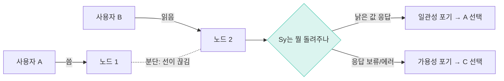
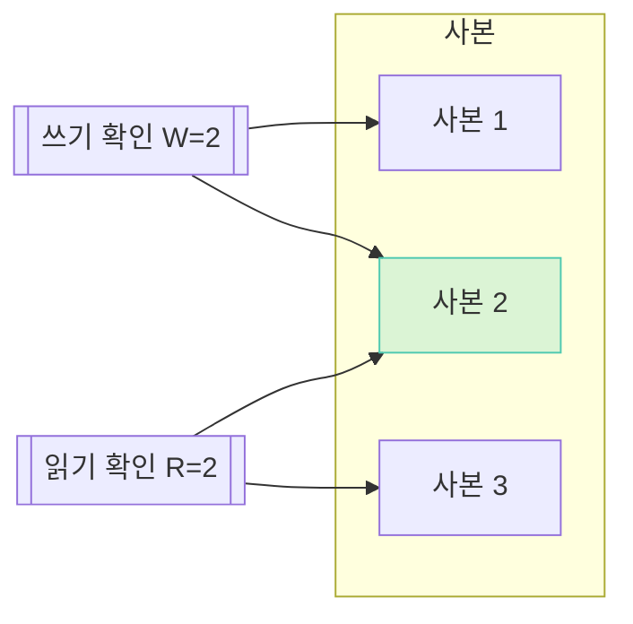
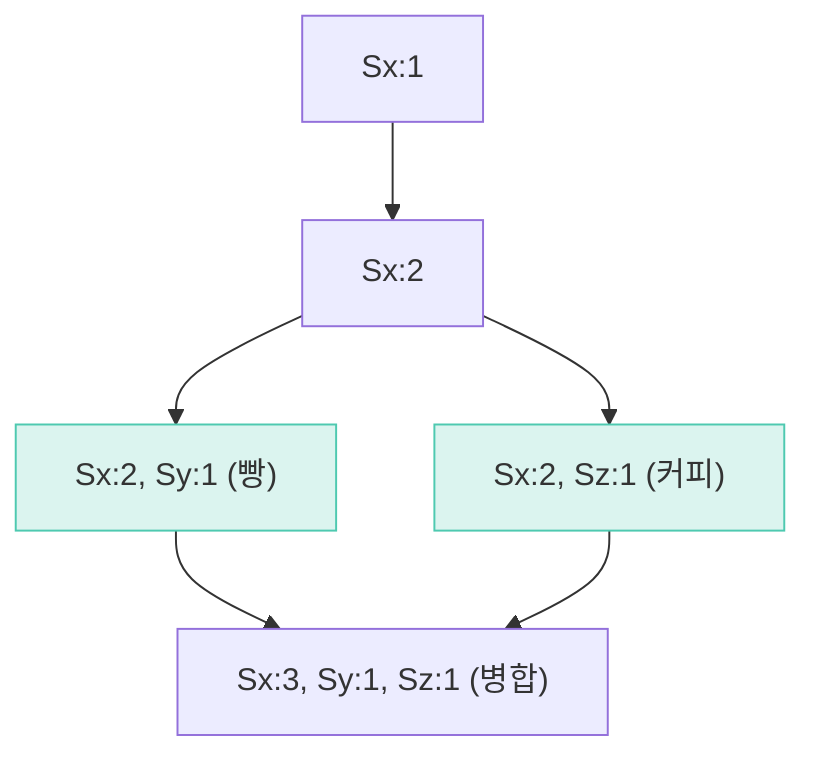
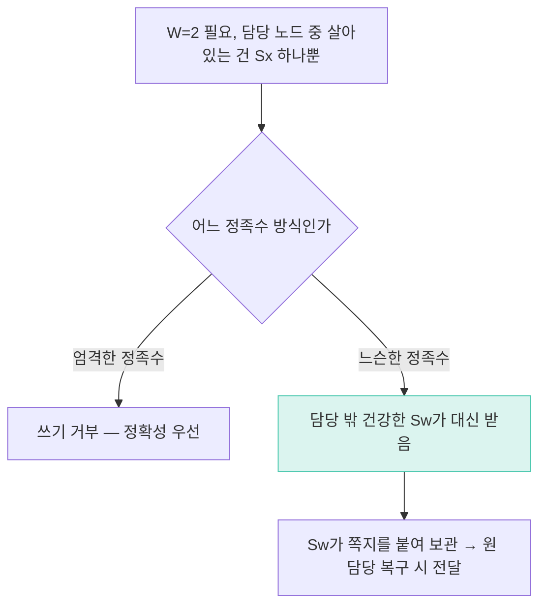
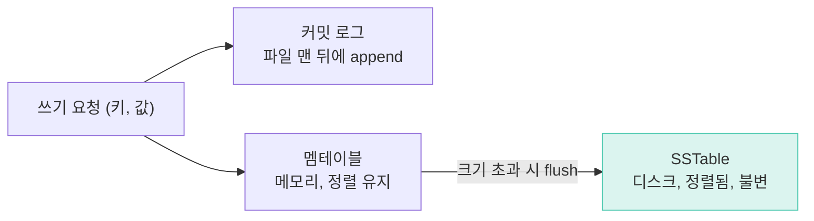
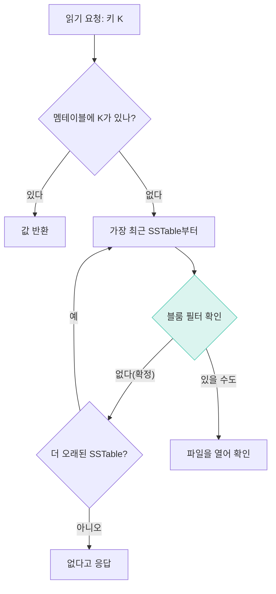

*NOTE << 요약자의 인사이트*
# 키-값 저장소 (Key-Value Store)
- `get(key)` / `put(key, value)` 단 두 개의 API로 돌아가는 저장소를 처음부터 설계
- 8장·11장처럼 DB를 부품으로 쓰는 장이 아니라, **그 부품 안쪽을 뜯어서 만드는 장**
	- NOTE) 한 문장으로 줄이면 「카산드라를 처음부터 만들어 본다」
- 원서 6장 중 분량이 제일 많다 — CAP·정족수·벡터 시계·가십·머클 트리·LSM 트리까지 훑음

# 1단계 요구사항
1. `put(key, value)` / `get(key)` 두 개의 API
2. 키-값 쌍의 크기는 작게 (보통 10KB 이하)
3. 큰 데이터도 저장 가능
4. 높은 가용성 — 장애 상황에도 빠르게 응답
5. 규모 확장성 — 트래픽 증가에 맞춰 수평 확장
6. 조절 가능한 일관성
7. 낮은 응답 지연시간

# 2단계 개략적 설계안 제시 및 동의 구하기
## 단일 서버 키-값 저장소
- 메모리 해시테이블 하나에 전부 담으면 요구사항 1~3까지는 사실 끝
- 그런데 메모리는 무한하지 않음 → 압축, 자주 안 쓰는 값은 디스크로 내리는 식으로 버틸 수 있는 데는 한계
- **결정적 문제는 따로 있음.** 그 한 대가 죽으면 서비스 전체가 죽는다(단일 장애점, SPOF)
- 그래서 같은 데이터를 여러 대에 나눠 담는다 — 사본을 두는 순간 이 장이 시작됨

## 사본을 두는 순간 생기는 문제
- 사본(replica)을 여러 벌 두면 한 대가 죽어도 서비스는 안 죽는다. 그런데 그 순간부터 **사본들이 서로 달라지는 문제**가 새로 생긴다
- 분단(네트워크가 끊기는 사고) 없이도 사본은 달라진다 — 한 사본에 쓴 값이 다른 사본에 전달되는 데는 항상 시간이 걸리기 때문. 분단은 그 시간이 무한히 길어진 극단일 뿐

NOTE) 「파티션」이 이 장 안에서 두 뜻으로 쓰인다. **데이터 파티션**(샤딩 — 데이터를 쪼개 나눠 담는 것, 내가 설계로 정함)과 **네트워크 파티션**(분단 — 노드 사이 선이 끊기는 사고, 내가 못 정함). 원서도 둘 다 partition 이라 헷갈리기 쉽다. 여기서는 앞의 것만 파티션, 뒤의 것은 분단이라 부른다.

NOTE) 6장은 DB 를 쓰는 장이 아니라 만드는 장이다. 8장·11장이 "MySQL 쓴다" 한 줄로 끝내는 그 안쪽을, 6장은 처음부터 짓는다. `get`/`put` 이 API 의 전부라는 단출함 자체가 함정 — 복잡함이 API 밖으로, "노드가 여러 대"라는 사실 자체로 옮겨간 것뿐이다.

## CAP 정리
- Consistency(일관성) · Availability(가용성) · Partition tolerance(분단 감내) 의 앞글자
- **정의**
	- C = 읽으면 무조건 가장 최근에 쓴 값이 나온다
	- A = 안 죽은 노드는 모든 요청에 (에러 아닌) 답을 준다
- 흔히 "셋 중 아무 둘이나 고르는 메뉴"로 알려져 있는데 **부정확**하다



- **급소는 여기다.** C·A는 내가 설계로 정하는 것이지만, **P는 내가 고르는 게 아니라 네트워크가 던지는 사건**이다. 케이블이 빠지고 스위치가 죽는 건 확률의 문제지 선택의 문제가 아니다
- 그러니 "P 를 버린다"는 말의 진짜 뜻은 **"분단은 안 일어난다고 가정한다"**이지 보장이 아니다
- 그 가정이 실제로 깨지면 두 노드가 각자 결정을 내리고 결과가 갈라지는 **스플릿 브레인**이 난다 — 이때 시스템은 CA 를 의도했지만 실제로는 C 를 잃은 AP 로 전락한다
- **그래서 "CA" 칸에 실제로 들어가는 건 애초에 분산이 아닌 시스템뿐이다.** 노드가 한 대뿐이면 분단이라는 사건 자체가 성립하지 않는다(Postgres 한 대가 CA 인 이유)
- Eric Brewer 본인이 2012년 "CAP Twelve Years Later" 에서 "2 of 3" 표현이 오해를 부른다고 직접 정정했다. 정확히는 **분단이 났을 때 뭘 포기하느냐**의 문제

| 요청 종류 | 선호 | 이유 |
|---|---|---|
| 은행 잔액 조회 | CP | 틀린 잔액을 보여주느니 잠깐 안 보여주는 게 낫다 |
| 장바구니 담기 | AP | 잠깐 어긋나도 되니 항상 응답하는 게 낫다 |

NOTE) 분단이 없는 평소는 CAP 이 침묵한다. 그 평소엔 사본 몇 대를 기다릴지(=정족수)가 지연과 일관성 사이의 다이얼이 되는데, 이걸 CAP 에 이어붙인 게 PACELC(`분단 났으면 A or C, 아니면 L or C`)다.

## 시스템 컴포넌트
아래 순서로 하나씩 짚는다.

| 컴포넌트 | 하는 일 |
|---|---|
| 데이터 파티션 | 어느 노드가 이 키를 맡을지 정함(샤딩) |
| 데이터 다중화 | 담당 노드부터 N개에 사본을 채움 |
| 일관성 — 정족수 | 몇 대에 쓰고 몇 대를 읽을지 |
| 불일치 해소 — 벡터 시계 | 갈라진 값 중 뭘 버리고 뭘 남길지 |
| 장애 감지 — 가십 | 누가 죽었는지 소문으로 퍼뜨림 |
| 일시적 장애 | 느슨한 정족수·힌티드 핸드오프 |
| 영구 장애 | 반-엔트로피·머클 트리 |
| 데이터센터 장애 | 사본을 여러 데이터센터에 분산 |
| 시스템 아키텍처 | 코디네이터, 무중심 구조 |

# 3단계 상세 설계

## 데이터 파티션
- [[5장 안정 해시 설계]] 에서 다룬 그 안정 해시 링을 그대로 쓴다 — 자세한 내용은 그쪽 참고
- 키를 링 위에 얹고, 시계방향으로 처음 만나는 노드가 담당. 노드가 늘거나 줄어도 재배치되는 키는 평균 k/n 개뿐

## 데이터 다중화
- 담당 노드부터 **링을 시계방향으로 따라가며 만나는 N개의 노드**에 똑같은 값을 하나씩 둔다
- 관행적으로 **N=3**. 다이나모 논문의 typical 값이자 카산드라 replication factor 로도 흔히 쓰이는 구성 — 2는 대조 상대가 하나뿐이라 애매하고, 4·5는 관리 비용과 어긋날 조합만 늘어 이득이 빠르게 줄어듬
- 가상 노드를 쓸 때는 **같은 물리 노드가 담당 목록에 겹치지 않게** 골라야 한다 — 안 그러면 사본 N벌이 실제로는 물리 서버 한두 대에 몰려 다중화의 의미가 사라짐

## 일관성 — 정족수
```
N = 사본 몇 벌인가        (보통 3)
W = 쓸 때 몇 대의 확인을 받고 성공 처리할까
R = 읽을 때 몇 대에서 읽어볼까
```
- **`N` 은 전체 서버 대수가 아니라 그 키 하나의 사본 수다.** 서버가 10대든 1,000대든, `W`·`R` 은 그 키의 **담당 목록** 안에서만 센다
- **`W + R > N` 이면 읽기가 항상 최신값을 본다.** 이유는 확률론이 아니라 **비둘기집 원리** — 쓰기가 성공한 W대와 읽기가 확인한 R대를 합치면 N벌짜리 사본 중 반드시 한 대가 겹친다



**실측 — 정족수 조합별 최신값 적중률** (2026-09-03 라즈베리파이 5, N=3, 지연 노드가 아직 못 받았을 확률 30%, 조합마다 10만 회)

```
 W  R  W+R>N?   최신값 읽음
 1  1     아니오      80.15%
 1  2     아니오      96.97%
 2  2       예     100.00%
 3  1       예     100.00%
```

- `W+R>N` 인 칸만 정확히 100.00%. **`W=1, R=2` 의 96.97% 가 제일 위험하다** — 거의 맞아서 테스트로는 안 걸리고 운영에서 가끔 샌다
- NOTE) 이 규칙도 조건부다. 담당 노드가 모자라 대타(담당 목록 밖 노드)가 쓰기를 받으면(뒤의 느슨한 정족수) 쓰기 집합과 읽기 집합이 같은 N벌 안에서 겹친다는 전제가 깨져 `W+R>N` 보장도 같이 깨진다
- 정족수가 실제로 주는 건 "최신"이 아니라 **"관련 버전을 빠뜨리지 않는 것"**이다. `Sx`와 `Sy`가 서로 모른 채 거의 동시에 다른 값을 쓰면, 그 사이엔 애초에 "최신"이라는 게 없다 — 둘 다 살려야 하고, 그 판정은 정족수가 아니라 벡터 시계의 몫이다

## 일관성 불일치 해소 — 벡터 시계
- 사본이 여러 벌이면 `get` 도 값 하나(`Optional`)가 아니라 **여러 개(`List`)**를 돌려줄 수 있다. 이렇게 갈라져 돌아온 값들을 **형제(siblings)**라 부른다
- 타임스탬프로 "늦은 쪽만 남기고 버리는" 방식이 **LWW(Last Write Wins)** 인데, 문제가 있다 — 폰에서 우유를 담고 노트북에서 계란을 담았는데 LWW 를 쓰면 늦게 쓰인 쪽만 남아 **다른 쪽이 조용히 사라진다**
- 벡터 시계는 표기가 `[Sx:2]` 처럼 생겼는데, **시각이 아니라 그 노드가 이 키를 손댄 횟수**다. 쓸 때마다 자기 이름의 카운터를 1 올릴 뿐
- 두 시계 `D1 ≤ D2` (D1의 모든 항목이 D2에서 같거나 큼) 면 `D1`은 `D2`의 **조상** — 버려도 안전. 어느 쪽도 성립 안 하면 **충돌** — 둘 다 남겨야 함
- **핵심 규칙: 읽고 나서 쓰면, 읽었을 때 들고 있던 시계를 그대로 들고 간다.** 그래서 항목이 **빠져 있는 것 자체가 "그걸 못 보고 썼다"는 증거**가 된다



- "동시에 썼다"는 시간이 겹쳤다는 뜻이 아니라 **서로의 버전을 못 본 채 쓴 것**을 말한다 — 1시간 차이여도 못 봤으면 동시, 1밀리초 차이여도 읽고 썼으면 순서가 있는 것

NOTE) `@Version` 낙관적 락은 노드 1개짜리 벡터 시계다. 단일 DB는 쓰기가 한 줄로 서니 카운터 하나로 충분하고, 사본이 N벌이면 줄이 N개라 카운터도 N개(=벡터) 필요하다. 다만 처리 방식은 다르다 — `@Version`은 충돌 시 예외를 던지고 재시도시키지만, 벡터 시계는 재시도할 단일 트랜잭션이 없어서 형제 둘 다 돌려주고 병합을 애플리케이션에 맡긴다.

NOTE) 카산드라는 벡터 시계를 안 쓴다. 셀 단위 타임스탬프 LWW 로 못박았다. 이유가 실용적이다 — 형제를 여러 개 돌려주면 애플리케이션이 매번 병합 코드를 짜야 하는데, 현실에서 다들 그걸 안 한다. 판단 기준은 하나: **누적되는 것(장바구니·태그)이면 병합이 필요하고, 덮어쓰는 것(센서 측정값·마지막 명령)이면 LWW 로 충분하다.**

## 장애 감지 — 가십 프로토콜
- 감시 서버를 한 대 두는 중앙 감시 방식은 그 한 대가 SPOF 이자 병목이 된다 — 감시자를 늘려도 "감시자를 감시하는 문제"가 그대로 되돌아온다
- 그래서 **중앙 감시자 없이 노드들끼리 소문처럼 서로의 생사를 퍼뜨리는** 방식을 쓴다 — **가십(gossip)**
- 각 노드는 멤버십 목록(노드별 **심장박동** 카운터)을 들고, 주기적으로 자기 카운터를 올리고 무작위로 고른 몇 대에게 목록 전체를 보낸다. 받은 쪽은 심장박동이 더 큰 쪽으로 병합한다
- 옆 노드하고만 주고받아도 그 노드가 들고 있던 제3자 소식까지 같이 실려 오기 때문에, 전파는 노드 수가 아니라 **노드 수의 로그**에 비례해서 퍼진다

**실측 — 가십 전파 라운드** (노드 하나가 아는 사실이 전체에 퍼지기까지, 2000회 평균)

```
 노드수   fanout=1  fanout=2  fanout=3   log2(n)
    10       6.63      3.88      2.99      3.32
   100      12.45      7.39      5.68      6.64
  1000      18.06     10.65      8.18      9.97
```

- 노드가 100배(10→1000) 늘어도 라운드는 3배 남짓. fanout 을 1→3으로만 올려도 1000대 기준 18.06→8.18 라운드로 절반 이하

NOTE) 가십은 죽음을 **확정하지 못한다.** 응답이 없는 게 정말 죽은 건지 분단이라 나머지와 말이 안 통하는 것뿐인지, 밖에서는 구분할 방법이 없다 — CAP 절에서 본 것과 똑같은 한계다. 가십이 주는 건 "확정"이 아니라 **"의심"**이다.

## 일시적 장애 처리 — 느슨한 정족수·힌티드 핸드오프
- 담당 노드 일부가 잠깐 안 보이면(재배포·GC 정지·순간 끊김) **엄격한 정족수**는 쓰기를 거부한다 — 정확하지만 응답을 못 준다
- **느슨한 정족수(sloppy quorum)**는 담당 밖의 건강한 노드가 대신 받는다. 대신 받은 노드는 "이건 원래 누구 몫"이라는 쪽지를 붙여 보관하는데, 이걸 **힌티드 핸드오프(hinted handoff)**라 부른다. 원 담당이 돌아오면 넘겨준다



- 대가가 있다. **느슨한 정족수를 쓰면 `W+R>N` 보장이 깨진다** — 대타(`Sw`)는 담당 목록 밖이라 정상 읽기가 애초에 그쪽에 안 가고, 그동안 담당 목록 안에서만 읽으면 옛 값이 나올 수 있다

## 영구 장애 처리 — 반-엔트로피와 머클 트리
- 노드가 오래 떨어져 있다 복구되면(디스크 교체, 며칠간 분단) 쪽지 몇 개로는 감당이 안 된다 — 두 사본이 대체 얼마나 다른지부터 알아내야 함. 이 재동기화가 **반-엔트로피(anti-entropy)**
- 100만 개 키를 하나씩 대조하면 너무 비싸다. **머클 트리**는 키들을 리프에 놓고 위로 올라가며 짝지어 해시하는 이진 트리를 만든다. **루트 해시 하나만 같으면 그 아래 전부 같다**고 본다. 다르면 자식 쪽으로만 내려가 실제 어긋난 키를 찾는다

**실측 — 머클 트리 비교 횟수** (두 사본에서 키 하나만 다를 때)

```
키     1,024개 → 머클 21회   (전량 1,024회)
키    65,536개 → 머클 33회   (전량 65,536회)
키 1,048,576개 → 머클 41회   (전량 1,048,576회)
```

- 키가 1,024배 늘 때 비교는 21 → 41회 (약 2배). 불일치 리프가 하나일 때 총 비교 횟수는 `1 + 2 × 트리 높이`이고, 트리 높이는 키가 두 배가 될 때마다 딱 1씩만 는다

## 데이터센터 장애
- 데이터센터 하나가 통째로 나가면 가십도 힌티드 핸드오프도 머클 트리도 소용없다 — 그 안의 사본이 전부 같이 죽으니까
- 해법은 새 장치가 아니라 **배치**다. 사본을 여러 데이터센터에 흩어 둔다
- NOTE) N을 늘리는 것과 사본을 흩어 놓는 것은 다른 문제를 푼다. N=3을 같은 데이터센터 안에 몰아두면 정전 한 번에 셋 다 같이 나간다. N은 "몇 대가 죽어도 버티는가", 분산 배치는 "한 사고가 몇 대를 한꺼번에 끌고 가는가"를 다룬다

## 시스템 아키텍처 — 코디네이터, 무중심 구조
- 요청을 받은 아무 노드나 그 요청의 **코디네이터**가 된다. 담당 노드를 계산하고, 요청을 뿌리고, 정족수를 채웠는지 확인해 응답한다
- 고정된 주인 노드가 없는 **무중심(leaderless)** 구조 — 다음 요청은 다른 노드가 코디네이터가 될 수 있다
- NOTE) 무상태(애플리케이션 서버)와 무중심(저장소 노드)은 다르다. 무상태는 "기억이 없다"는 뜻이고, 무중심은 "기억은 있는데 대표가 고정돼 있지 않다"는 뜻이다

## 한 대 안에서는 어떻게 저장하나
지금까지는 여러 대 사이의 이야기였다. 여기부터는 **노드 한 대 안**, 분산과 무관하게 한 대짜리 저장소에도 그대로 적용되는 이야기다.

- B-tree 는 정렬을 유지하려고 매번 제자리를 찾아 쓴다 — 그 탐색 자체가 느리다. 제일 빠른 쓰기는 파일 뒤에 그냥 붙이는 것(append)인데, 그러면 이번엔 읽기가 곤란해진다. 이 긴장을 절충하는 게 아래 세 조각

### 쓰기 경로 — LSM 트리


- **커밋 로그** — 파일 맨 뒤에 그냥 이어 붙인다. Postgres 의 WAL 과 같은 역할, 목적은 장애 복구뿐. 정전이 나도 재시작 시 처음부터 재생해 메모리를 복원한다
- **멤테이블** — 메모리 안의 정렬된 자료구조(레드-블랙 트리 등). 커밋 로그는 순서만 보장하고 정렬은 안 하니, 실제 조회는 이쪽이 담당
- **SSTable(Sorted String Table)** — 멤테이블이 다 차면 정렬된 채로 디스크에 통째로 내려쓴다. 한 번 쓰면 다시 고치지 않는 **불변** 파일. 수정도 삭제도 새 기록을 추가하는 것으로 처리하고, 삭제는 **툼스톤**으로 표시한다
- 이 세 조각(커밋 로그 → 멤테이블 → SSTable)을 합친 구조 전체의 이름이 **LSM 트리(Log-Structured Merge-tree)**
- 시간이 지나면 SSTable 이 계속 쌓인다 — 이걸 병합 정렬 방식으로 정리하는 백그라운드 작업이 **컴팩션**. 오래된 버전을 합치고, 더는 필요 없는 툼스톤을 걷어낸다

### 읽기 경로 — 멤테이블 → 블룸 필터 → SSTable


- 값이 멤테이블에 없으면 SSTable 을 최신 것부터 뒤진다. SSTable 이 여러 개라 **존재하지 않는 키를 확인하는 쪽이 오히려 더 비싸다** — 있는 파일을 전부 열어보고서야 "없다"고 답하게 됨
- 이 낭비를 줄이는 게 **블룸 필터**. SSTable 마다 작은 비트 배열을 두고, 키마다 여러 해시 함수로 몇 자리를 켜둔다. 확인할 때 한 자리라도 꺼져 있으면 **확실히 없음** — 파일을 아예 안 연다. 전부 켜져 있으면 있을 수도 있어 파일을 연다

**실측 — 블룸 필터 오탐률** (없는 키 10만 개를 물었을 때 "있다"고 잘못 답한 비율)

```
 키당 비트   메모리     오탐률    이론값    '없다' 오답
       8     97.7KB    2.179%   2.158%      0건
      10    122.1KB    0.837%   0.819%      0건
      16    195.3KB    0.053%   0.046%      0건
```

- **「없다」 오답이 전 설정 0건.** 블룸 필터는 이 방향으로만 틀리게 설계된다 — **거짓 부정은 없고, 거짓 긍정만 가능하다.** 있는 데이터를 못 찾는 사고보다, 없는 걸 한 번 더 열어보는 헛수고가 훨씬 싸기 때문
- 키당 10비트로 10만 개를 122.1KB에 담고 오탐 0.837%면 메모리는 거의 공짜

NOTE) LSM 트리가 항상 좋은 건 아니다. 쓰기는 빠르지만 읽기는 여러 SSTable을 뒤져야 하고, 옛 버전이 컴팩션 전까지 중복으로 남아 공간도 더 쓴다. Postgres·MySQL 이 여전히 B-tree 를 쓰는 이유가 이거다 — 읽기가 잦고 같은 행을 자주 제자리 갱신하는 데이터엔 B-tree, 쓰기가 압도적이고 갱신이 드문 데이터(시계열·이벤트 로그)엔 LSM 트리가 낫다.

# 마치며

키-값 저장소가 주는 것.
- `get`/`put` 두 API 뒤에서 죽어도 안 죽고, 규모가 커져도 늘어나는 저장소
- 조절 가능한 일관성 — 요청 종류에 따라 CP 쪽에 가깝게도, AP 쪽에 가깝게도 다이얼을 돌릴 수 있음(카산드라의 tunable consistency)

실제로 쓰이는 곳.
- 아마존 다이나모, 아파치 카산드라, Riak — 이 장이 설계한 접근을 그대로 따르는 저장소들
- RocksDB·LevelDB·HBase — LSM 트리 쪽 구현체

NOTE) 이 장이 못 푸는 것도 있다. 벡터 시계는 "충돌인지 아닌지"만 판정하지 **합쳐주지는 않는다** — 병합 로직은 여전히 애플리케이션의 몫이라, 실무에서 카산드라가 LWW로, 요즘 저장소들이 CRDT로 도망친 이유가 여기 있다. 그리고 가십은 장애를 "확정"하지 못하고 "의심"만 준다 — 죽음과 분단이 밖에서 똑같이 보이는 이상, 이 불확실성은 어떤 프로토콜을 얹어도 원리적으로 남는다.
