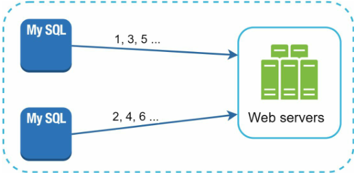
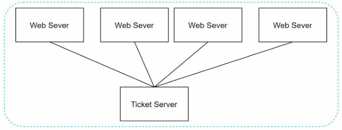
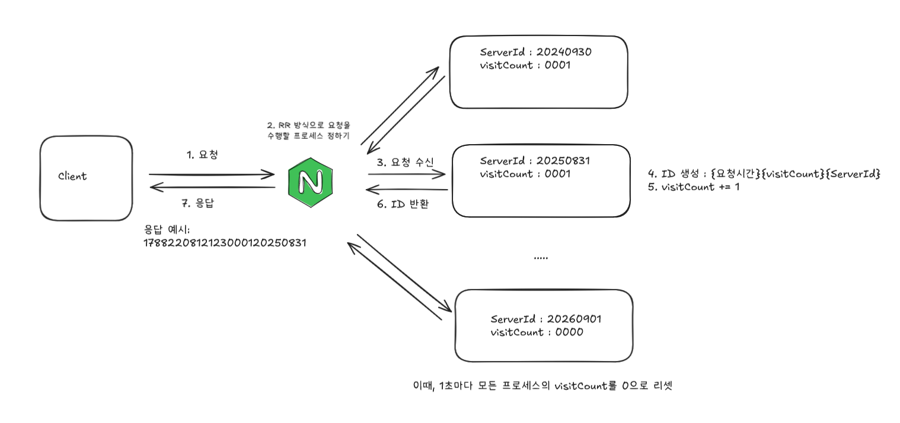

# 개요 
- 여러 컴퓨터가 서로 같은 숫자를 생성하지 않기를 기대하면서 랜덤하게 숫자를 생성한다고 생각해 보자. 아무리 랜덤하게, 아무리 넓은 범위에서 생성하더라도 충돌이 절대 일어나지 않는다는 보장은 없다.
- 이 챕터에서는 분산 시스템에서 안정적으로 고유한 ID를 생성하는 방법을 다룬다.
# 본문 
## 다중 마스터 복제

- 여러 DB 서버를 마스터로 두고, 각 서버에서 독립적으로 ID를 생성하는 방식
- 각 서버가 서로 다른 시작값이나 증가 간격을 사용하도록 설정하여 ID가 겹치지 않도록 한다.
- 예를 들어 2개의 서버가 있다면:
    - Server A → `1, 3, 5, 7, ...`
    - Server B → `2, 4, 6, 8, ...`
### 장점
- 중앙에서 ID를 발급하는 서버가 필요 없음
- 특정 서버가 장애가 발생하더라도 다른 서버에서 ID 생성을 계속할 수 있음
### 단점
- 서버가 추가되거나 제거될 때 ID 생성 규칙을 변경해야 할 수 있음. 확장성이 떨어짐
- 여러 서버의 ID 생성 범위를 관리해야 하므로 구현 및 운영이 복잡함
- 전역적으로 시간 순서가 보장되는 ID를 생성하기 어려움
## UUID
- 각 서버가 자신만의 UUID를 만드는 로직을 가진다

v7 버젼
```
127                                                      80 79        76 75          64 63      62 61                           0
┌──────────────────────────────────────────────────────────┬───-─────-──┬──────────────┬──────────┬──────────────────────────────┐
│                    unix_ts_ms (48 bits)                  │ version(7) │   rand_a     │ variant  │          rand_b              │
│                                                          │   4 bits   │   12 bits    │  2 bits  │          62 bits             │
└──────────────────────────────────────────────────────────┴────--──────┴──────────────┴──────────┴──────────────────────────────┘
```

|     비트 | 필드           | 설명                                       |
| -----: | ------------ | ---------------------------------------- |
| **48** | `unix_ts_ms` | 밀리초 단위의 Unix 타임스탬프                       |
|  **4** | `version`    | UUIDv7을 나타내는 버전 번호 `0111`                |
| **12** | `rand_a`     | 밀리초보다 작은 단위의 정밀도, 단조 증가 카운터 또는 의사 난수 데이터 |
|  **2** | `variant`    | UUID 변형을 나타내며, `10`으로 고정                 |
| **62** | `rand_b`     | 단조 증가 카운터 또는 난수 데이터                      |
- 총 128 bits
- v7 부터는  시간순 정렬 가능
- 숫자로만 이뤄져 있는 것은 아님
### 장점
- 분산 시스템 내 생성되는 ID가 모두 고유한 값을 보장하기 위한 시스템을 설계할 필요 없음
- 엄청난 확장성.
### 단점
- 충돌의 확률이 아주 낮을 뿐아지 충돌이 일어나지 않는다고 보장은 못 함.
## 티켓 서버

- 한 서버가 각 요청에 직접 ID를 배분하는 방식
- Flicker 같은 경우 이를 도입 함
### 장점
- 간단한 구현
### 단점
- SPOF (Single point of failure)
- 확장성이 떨어짐.
## 트위터 스노플레이크 접근법 
```
63        62                                        21                            11                    0
┌─────────┬───────────────────────────────────────-──┬─-───────────────────────────┬────────────────────┐
│  Sign   │             Timestamp / Epoch            │         Worker ID           │      Sequence      │
│ 1 bit   │                  41 bits                 │          10 bits            │      12 bits       │
└─────────┴───────────────────────────────────────-──┴─-───────────────────────────┴────────────────────┘
```

| 비트 필드 설명 |             |                                     |
| -------- | ----------- | ----------------------------------- |
| **1**    | `sign`      | 부호 비트. 항상 `0`으로 고정                  |
| **41**   | `timestamp` | Snowflake 자체 epoch 기준의 밀리초 단위 타임스탬프 |
| **10**   | `worker_id` | ID를 생성하는 머신/프로세스를 식별하는 워커 ID        |
| **12**   | `sequence`  | 같은 밀리초 내에서 생성되는 ID를 구분하기 위한 순번      |
- Twitter에서 만든 시스템
- 이론상 시작부터 대략 67년 동안 (41비트로 millisecond를 계산했을 때) 버틸 수 있음
- 트위터는 `worker_id` 를 Datacenter ID (5비트),  Machine ID (5비트로 나눔)
# 시스템 설계 
## 시스템 요구사항
- 고유하고 정렬 가능해야 합니다. 
- 나중에 생성된 ID는 이전에 생성된 ID보다 커야 합니다.
- 숫자만 포함해야 하며, 64비트 정수로 표현 가능해야 합니다.
- 시스템은 초당 10,000개의 ID를 생성할 수 있어야 합니다.
## 1단계만 읽은 후 설계

- Round robin 방식으로 요청을 처리하는 서버들이 있는 구조
- 각 서버는 다음과 같은 ID를 반환한다. → `{timestamp}{visitCount}{serverID}`
    - `requestTimestamp`: Epoch timestamp
    - `visitCount`: 해당 서버에 요청이 몇 번 들어왔는지를 나타내며, 매초 0으로 초기화된다.
    - `serverID`: 서버가 생성될 때 부여된 ID
## 전부 읽은 후 설계
```
63        62                                        21                            11                    0
┌─────────┬───────────────────────────────────────-──┬─-───────────────────────────┬────────────────────┐
│  Sign   │             Timestamp / Epoch            │         Worker ID           │      Sequence      │
│ 1 bit   │                  41 bits                 │          10 bits            │      12 bits       │
└─────────┴───────────────────────────────────────-──┴─-───────────────────────────┴────────────────────┘
```
- snowflake를 사용하자

## Application
- 적용해보기: 어떤 시스템에서 써볼 수 있을까?
- 단기적으로 수많은 기록이 생기는 작업, 그렇지만 영구적으로 보관할 필요 없는 기록
    - 로그 ID
    - 주문 내역
    - 피드
# 추가 리서치 
- 왜 signed bit (맨 앞의 0)을 넣었을까?
    - 2010년에는 Scala, Java에 unsigned bit가 없었고, MySQL에서는 숫자를 양수로 가정했다.
    - Java는 2014년에 출시된 Java 8부터 unsigned long 지원을 도입했다.
- Snowflake가 strictly sortable(엄격한 순서 정렬)하지 않은 이유는?
    - 스노플래이크 요구사항은 **strictly sortable**이 아니라 **roughly sortable**이었다.
        - ID가 생성된 정확한 순서를 보장하는 것보다는 비슷한 시간에 생성된 트윗들이 ID에서도 가까운 값을 가지는 것이 중요했다.
    - 트위터는 이를 **k-sorted**라고 표현했고, 당시 목표는 **1초 이내에 생성된 트윗들이 ID 공간에서도 가까운 위치에 있도록 하는 것**이었다
-  분산 환경에서 여러 서버가 동시에 ID를 생성하는데, 시간은 어떻게 통일 시간을 통일 시킬 수 있었을까?
    - 모든 컴퓨터가 완전히 정확하게 동일한 시간을 유지하는 것은 사실상 불가능하다.
    - 대신 NTP(Network Time Protocol) 를 활용해 각 서버의 시간을 기준 시간(UTC)에 최대한 가깝게 동기화하여 오차를 줄인다.([위키피디아 링크](https://en.wikipedia.org/wiki/Network_Time_Protocol#:~:text=NTP%20is%20intended%20to%20synchronize%20participating%20computers%20to%20within%20a%20few%20milliseconds%20of%20Coordinated%20Universal%20Time%20%28UTC%29%2E)).
    - 다만 NTP 역시 네트워크를 통해 시간을 동기화하기 때문에 네트워크 지연 등의 이유로 서버 간에 미세한 시간 차이가 발생할 수 있다.