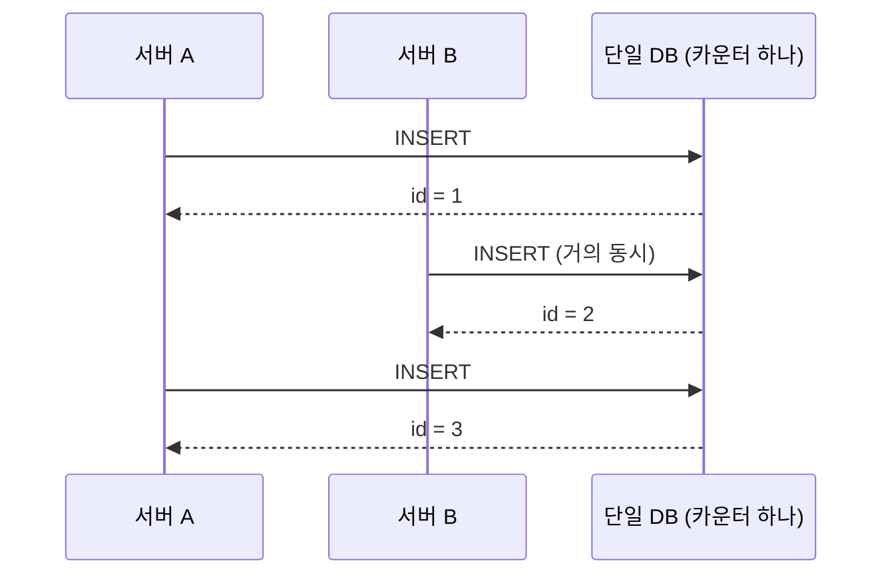
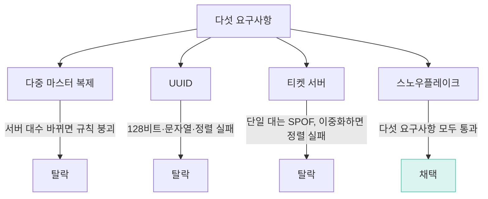
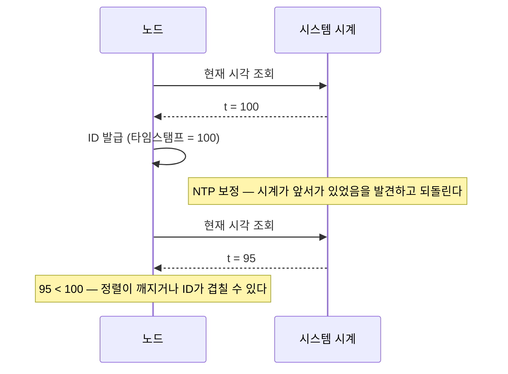

*NOTE << 요약자의 인사이트*
# 유일 ID 생성기 (Unique ID Generator)
- 서버 한 대면 시시한 문제. `AUTO_INCREMENT`/`BIGSERIAL` 카운터 하나로 끝
- 서버가 여러 대가 되는 순간 문제가 됨 — 각자 카운터를 돌리면 서로 다른 행에 같은 번호가 붙을 수 있음
- 원서 분량은 6장의 1/3 수준 — 얇은 장. 이번에도 한 편으로 끝

NOTE) [[6장 키-값 저장소 설계]]와의 연결 — 6장은 "같은 키를 여러 대가 나눠 갖는" 문제였고, 7장은 "여러 대가 안 겹치는 새 키를 만드는" 문제다. 방향이 반대다

# 1단계 요구사항

## 왜 어려운가
- 단일 DB가 쉬운 이유는 카운터가 **한 곳에만** 있어서다. 쓰기가 전부 그 한 줄로 합쳐지니 다음 번호가 항상 명확



- DB가 여러 대면 그 한 줄이 여러 줄로 쪼개진다. 서버 A·B가 각자 카운터를 돌리면 둘 다 "3번"을 매길 수 있다 — 서로 다른 두 행인데 ID가 같아짐
- 매번 다른 서버와 상의(락)하는 방법도 있지만: 통신 비용이 들고, 그중 한 대가 죽어 있으면 ID 생성 자체가 멈춘다

NOTE) 자동 증가 정수(auto increment)를 못 쓰는 게 핵심 제약이다. 단일 DB에서는 공짜였던 것이 분산되는 순간 설계 문제가 된다

## 요구사항 다섯
```
유일해야 한다
숫자로만 구성된다
64비트에 들어간다
시간순으로 정렬된다 (나중에 만든 ID가 더 크다)
초당 1만 개를 만들 수 있다
```

| 요구사항 | 왜 필요한가 |
|---|---|
| 유일 | 정의상 당연한 전제 |
| 숫자만 | 문자열보다 비교·정렬 연산이 쌈 |
| 64비트 | 정수 컬럼(`bigint`) 하나로 저장·색인 가능 |
| 시간순 정렬 | `ORDER BY id` 만으로 "최신부터" 조회가 공짜로 풀림 |
| 초당 1만 개 | 실제 서비스가 감당해야 할 처리량 |

- **넷째("시간순 정렬")가 이 장 전체를 관통.** 새 행일수록 최근에 조회될 확률이 높다 — ID 자체가 정렬돼 있으면 정렬 연산 없이도 그 조회가 풀린다

# 2단계 개략적 설계안

후보 넷을 다섯 요구사항에 대본다. 검토 순서: 다중 마스터 복제 → UUID → 티켓 서버 → 스노우플레이크.

## 다중 마스터 복제
- DB를 k대 두고, 각자 카운터를 `1`씩이 아니라 `k`씩 건너뛰며 증가시킨다 (2대면 홀수/짝수로 분리)
- 문제는 대수를 바꾸는 순간 시작된다. 2대→3대로 늘리면 새 간격(3)으로 다시 1부터 세기 시작해 기존에 이미 발급된 값과 겹친다
- 시간순 정렬도 원천적으로 안 된다 — 두 DB의 시계가 완벽히 같지 않은 한, 번호만 봐서는 어느 쪽이 먼저 생겼는지 알 수 없다

## UUID
- `UUID.randomUUID()` — 128비트 완전 무작위 값. 서버끼리 통신 없이도 유일성은 가볍게 통과
- 나머지 넷에서 걸린다: 64비트 초과(128비트, `bigint`의 2배), 숫자가 아닌 16진수+하이픈 문자열, 시간순 정렬 안 됨

NOTE) 64비트를 고집하는 이유 — BIGINT 한 칸에 들어가야 인덱스가 얇다. UUID 128비트가 탈락한 이유의 절반이 이것이다

**실측 — 기본키를 UUID vs 시간순 8바이트로 바꿨을 때** (2026-09-03/04, 라즈베리파이 5, 일회용 Postgres 16 컨테이너, 각 20만 행·payload 50바이트 동일)

이 실측은 한 번 뒤집힌 이력이 있다. 처음엔 "정렬 순서 때문에 인덱스가 1.90배"로 쟀는데, 교란변수(키 폭: UUID 16바이트 vs bigint 8바이트)가 섞여 있다는 지적을 받고 대조군을 하나 더 넣어 2×2로 다시 쟀다.

```
             실험     |  삽입 시간  |  인덱스   | leaf_pages | avg_leaf_density | leaf_fragmentation
----------------------+-------------+-----------+------------+------------------+--------------------
 A 16바이트 무작위    | 1204.088 ms |  8640 kB  |       1072 |            64.47 |              50.19
 B  8바이트 무작위    | 1306.198 ms |  5240 kB  |        650 |            75.78 |              50.31
 C  8바이트 시간순    |  500.716 ms |  4408 kB  |        547 |            90    |               0
```

- **삽입 시간·단편화는 순서 탓** — A→B(키 폭만 절반, 순서는 그대로 무작위)는 거의 안 변한다(1204→1306ms, 단편화 50.19→50.31). B→C(순서만 시간순으로 바뀜)에서 삽입은 2.61배 빨라지고 단편화는 50.31→0
- **인덱스 크기는 주로 키 폭 탓** — A→B에서 1.65배 줄고, B→C에서 추가로 1.19배만 더 준다(1.65×1.19=1.96배)
- 결론은 안 바뀐다: 정렬과 키 폭 둘 다 UUID가 못 지킨 요구사항이고, 삽입 속도·단편화는 정렬 하나로, 인덱스 크기는 키 폭이 더 큰 몫으로 설명된다

## 티켓 서버
- 번호 매기는 일만 전담하는 DB를 따로 둔다. 내부는 그냥 `AUTO_INCREMENT` 하나를 돌리는 평범한 DB (Flickr가 실제로 씀)
- 한 대만 두면 단일 장애점(SPOF) — 죽으면 시스템 전체의 쓰기가 멈춘다

NOTE) 티켓 서버는 왜 답이 아닌가 — 단일 장애점이다. 이중화하면 이번엔 두 대의 번호를 맞추는 문제가 새로 생긴다(6장이 통째로 그 문제였다)
- Flickr는 실제로 두 대를 둬서 홀수/짝수로 나눴다 — 다중 마스터 복제와 원리가 완전히 같고, 약점도 그대로 따라온다(대수 변경 시 규칙 붕괴, 시간순 정렬 안 됨)

## 후보 비교

| 후보 | 유일성 | 64비트·숫자만 | 시간순 정렬 | 약점 |
|---|---|---|---|---|
| 다중 마스터 복제 | 보장 | 만족 | 안 됨 | 서버 대수 변경 시 규칙 붕괴 |
| UUID | 보장 | 불만족(128비트) | 안 됨 | 인덱스 비대(실측) |
| 티켓 서버(단일) | 보장 | 만족 | 됨 | 단일 대라 SPOF |
| 티켓 서버(이중화) | 보장 | 만족 | 안 됨 | SPOF는 피하지만 다중 마스터와 같은 약점 |
| 스노우플레이크 | 보장 | 만족 | 됨 | 시계 역행에 취약 |



# 3단계 상세 설계

## 스노우플레이크 — 64비트 쪼개기
트위터가 2010년 트윗 하나하나에 붙일 ID를 만들려고 고안해 같은 해 오픈소스로 공개했다. 64비트 하나를 구획으로 잘라 각 구획에 서로 다른 정보(시각·서버 식별자·순번)를 담는다.

```
1 + 41 + 5 + 5 + 12 = 64
사인  타임스탬프  데이터센터  기계  일련번호
```

| 구획 | 크기 | 담는 값 |
|---|---|---|
| 부호 | 1비트 | 항상 0 (음수로 튀는 것 방지) |
| 타임스탬프 | 41비트 | 기준 시각(epoch)으로부터 흐른 밀리초 |
| 데이터센터 | 5비트 | 데이터센터 번호 |
| 기계 번호 | 5비트 | 같은 데이터센터 안의 기계 번호 |
| 일련번호 | 12비트 | 같은 밀리초 안에서 0부터 증가하는 순번 |

- `2^41` ms = **69.68년**(계산은 §5 검증 참고) → 그래서 기준 시각을 1970년이 아니라 **서비스 시작일**로 잡는다. 1970으로 잡으면 이미 56년 넘게 흘러 여유분의 절반 이상을 낭비하게 됨
- `2^5 × 2^5` = **1024대**(데이터센터 32 × 기계 32). 굳이 둘로 나눈 이유 — ID 하나만 봐도 어느 지역의 어느 기계인지 바로 드러나 장애 시 좁히기 쉬워진다
- `2^12` = **4096** → 같은 밀리초 안에서 한 기계가 4096개. 초당으로 환산하면 409만 6천개, 요구사항(초당 1만)의 400배 넘는 여유

```python
id = (timestamp << 22) | (datacenter << 17) | (machine << 12) | sequence
```
- `<<`는 왼쪽 시프트(값을 `2^n`배 하는 것). `timestamp`를 22칸 미는 이유는 그 아래 데이터센터(5)+기계(5)+일련번호(12)=22비트짜리 자리를 비워두기 위해서
- `|`는 자리별 OR. 시프트로 이미 서로 다른 칸에만 값이 있으니 `+`와 결과가 같다 — "각 구획이 독립된 칸에 산다"는 의도가 코드에 그대로 드러남

- ⭐ **타임스탬프가 상위 비트에 있어서, ID를 그냥 숫자로 비교하면 시간순 정렬이 된다.** 값을 비교하는 코드는 한 줄도 안 바꿔도 된다 — 자리 배치 자체가 정렬 규칙이 되는 것

NOTE) 스노우플레이크가 조율(coordination)을 없앤 방식 — 기계마다 자기 몫의 비트 구간을 미리 나눠 갖게 해서 실행 중에 서로 물어볼 일을 없앴다. 6장 정족수가 매 요청마다 서로 물어보던 것과 대비된다

NOTE) 비트 배분은 요구사항에서 역산된다 — "초당 1만 개"·"몇 년 쓸 것인가"·"기계 몇 대"가 각각 일련번호·타임스탬프·기계ID 비트 수를 정한다. 다른 서비스면 다르게 쪼개도 된다

## 시계 되돌림 함정
- 서버 시계는 NTP로 보정되는데, 항상 앞으로만 가는 게 아니다 — 시계가 앞서가 있었으면 NTP가 **뒤로 되돌린다**
- 어떤 기계가 timestamp=100일 때 ID를 발급하다 시계가 95로 되돌아가면: 같은 밀리초(95)가 예전에 이미 쓰였을 수 있고, 방금 만든 ID가 100번대보다 숫자가 작아 시간순 정렬이 깨질 수 있다



- 흔한 대응은 둘: **시계가 이전 최고 시각을 다시 넘어설 때까지 발급을 잠시 멈추고 기다리거나**, **예외를 던져 그 요청을 실패시키는 것**
- 이 대응이 가능하려면 노드가 자신이 마지막으로 발급했던 타임스탬프를 기억하고 있어야 한다
- 시계에 의존하는 설계의 대가다. 시간순 정렬을 공짜로 얻는 대신 시계 되돌림을 떠안았다

# 마치며

유일 ID 생성기가 주는 것.
- 단일 DB에선 카운터 하나로 끝난다. 여러 대가 되는 순간 그 한 줄이 쪼개져 문제가 생긴다
- 다중 마스터 복제·UUID·티켓 서버는 각각 다섯 요구사항 중 하나 이상을 놓친다
- 스노우플레이크가 답이다. 64비트를 부호(1)·타임스탬프(41)·데이터센터(5)·기계(5)·일련번호(12)로 쪼갠다
- 타임스탬프가 최상위 비트라 ID를 그냥 정렬하면 시간순이 된다 — 이게 공짜로 얻는 것

실제로 쓰이는 곳.
- 트위터(트윗 ID), 이후 ULID·KSUID·Sonyflake 등 같은 아이디어의 변형들

NOTE) 급소는 딱 하나, 시스템 시계가 뒤로 갈 때다. NTP 보정으로 시계가 되돌아가면 같은 밀리초가 재사용되어 ID가 겹치거나, 방금 만든 ID가 이전 ID보다 작아져 정렬이 깨진다. 시간순 정렬을 공짜로 얻은 대가가 정확히 여기서 청구된다.
