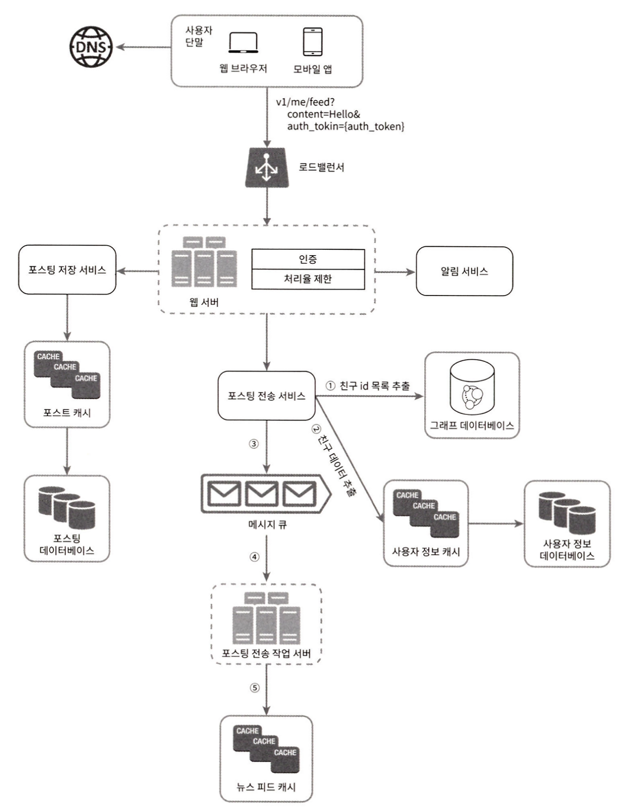
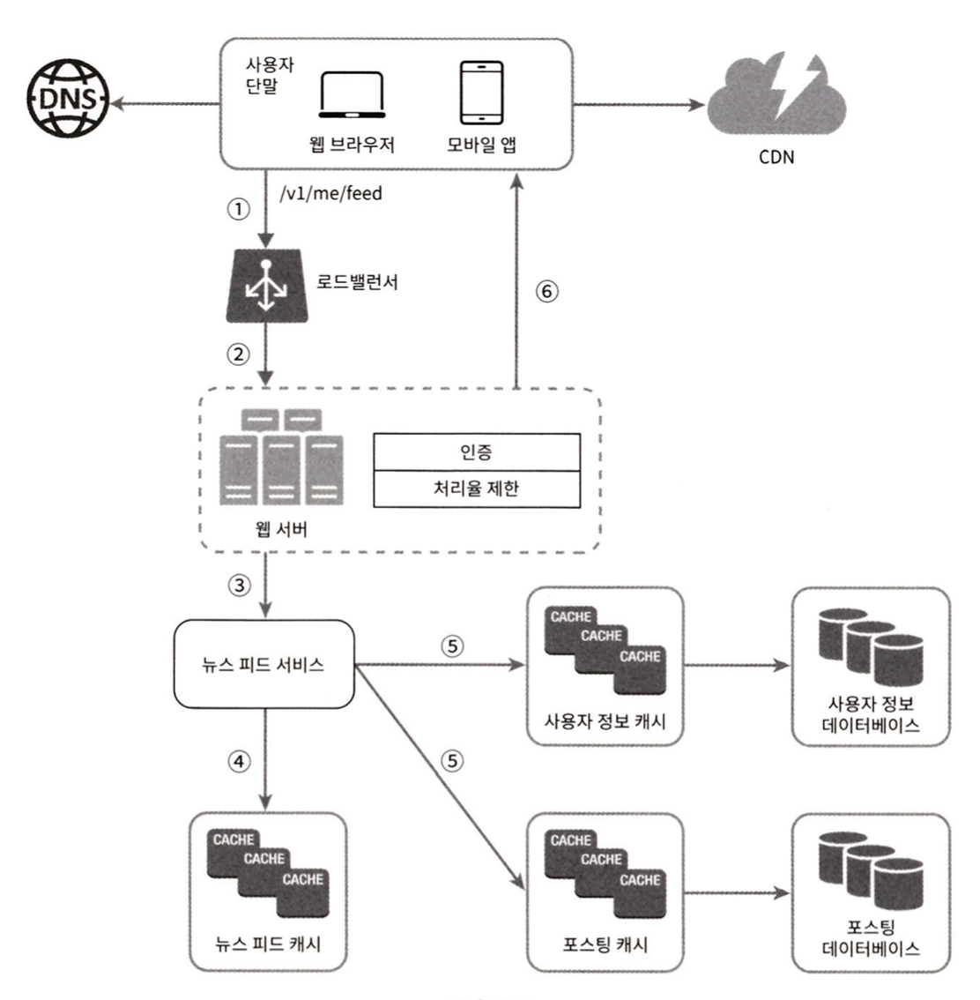
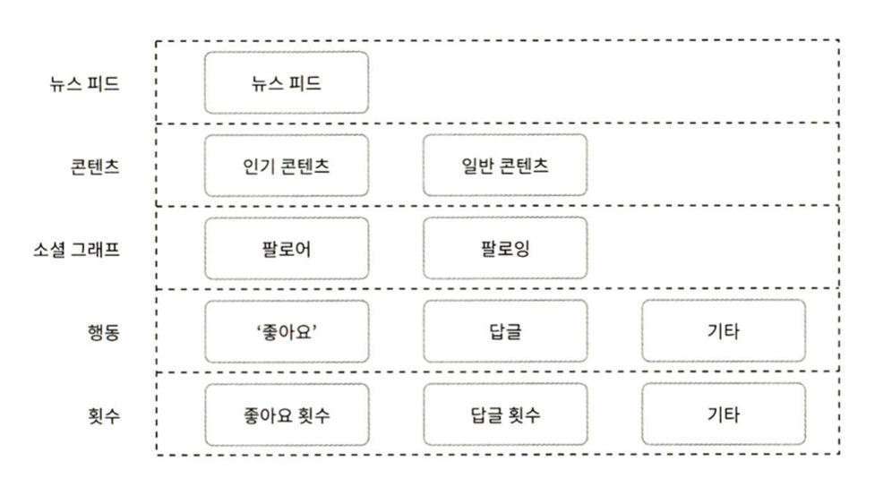
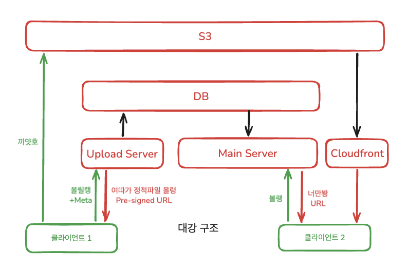
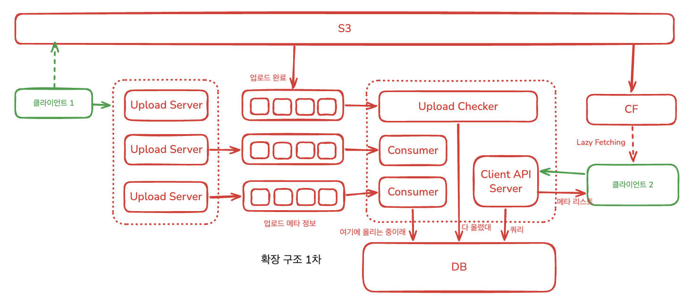
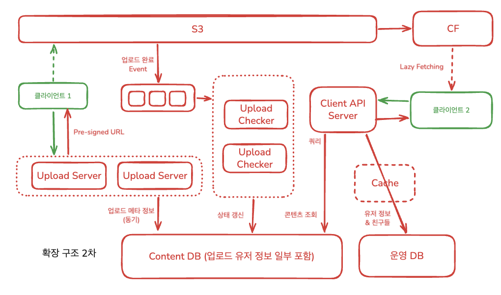
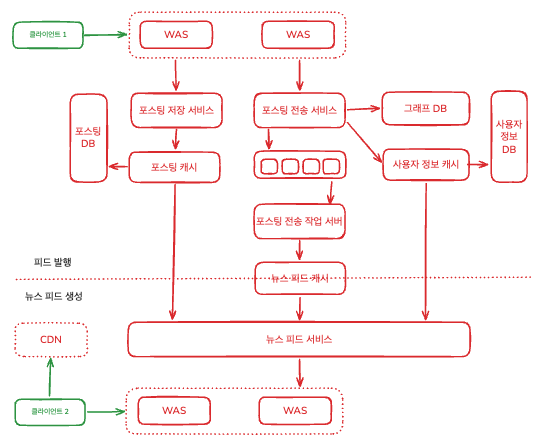
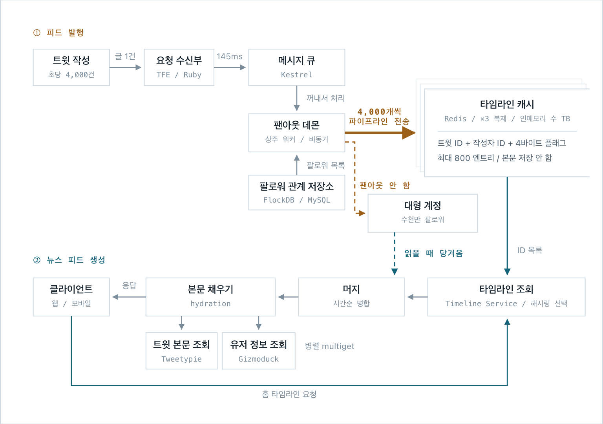
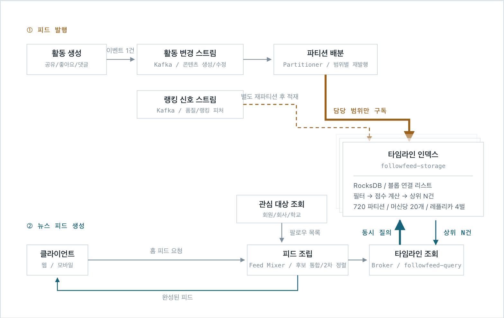
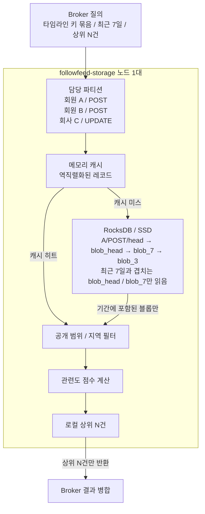

## 개요

> 홈페이지 중앙에 지속적으로 업데이트되는 스토리들인 뉴스피드 시스템을 설계해보자.

## 본문

- 뉴스 피드는 사용자 상태 정보 업데이트, 사진, 비디오, 링크, 앱 활동, 팔로우 대상, 페이지, 그룹으로 부터의 좋아요 등 넓은 영역을 포함한다.
- 단골 면접 문제로 "페이스북/인스타그램 피드 설계", "트위터 타임라인 설계" 등이 나온다.

### 웹 서버

- 클라이언트와 통신할 뿐 아니라 인증이나 처리율 제한을 앞단에서 처리하는 웹 서버를 둔다.

### 포스팅 전송(팬아웃) 서비스

> 포스팅 전송, 즉 Fanout은 어떤 사용자의 새 포스팅을 그 사용자와 친구 관계에 있는 모든 사용자에게 전달하는 과정

- 팬아웃에는 두 가지 모델이 있는데, 쓰기 시점에 팬아웃하는 모델(fanout-on-write 모델 / push 모델)과 읽기 시점에 팬아웃하는 모델(fanout-on-read 모델 / pull 모델)이 있다.

#### Fanout-on-write 모델

- 쓰기 시점에 팬아웃하는 모델은 새로운 포스팅을 기록하는 시점에, 대상 사용자들의 피드 캐시에 해당 포스팅을 기록한다.
- Pros: 뉴스 피드가 실시간으로 갱신되며, 읽는 시간이 짧아진다.
- Cons: 모든 친구의 목록을 가져와 갱신하기에 친구가 많으면 많은 시간이 소요된다.(hot-key) 또한 비활성 사용자들의 피드까지 갱신하여 컴퓨팅 자원이 낭비될 수 있다.

#### Fanout-on-read 모델

- 사용자가 본인 홈페이지 로딩 시점에 포스트를 가져오는 요청 기반(on-demand) 모델
- Pros: 컴퓨팅 자원 효율적이고, 핫 키 문제도 생기지 않는다.
- Cons: 뉴스 피드를 읽는데 많은 시간이 소요될 수 있다.

### 팬아웃 서비스 동작

1. 그래프 DB에서 친구 ID 목록을 가져온다.
  - GraphDB는 친구 관계나 친구 추천을 관리하기 적합하기 때문
2. 사용자 정보 캐시에서 친구들의 정보를 가져온다.
  - 사용자 설정에 따라 친구 가운데 일부를 걸러낼 수도 있다.
  - 친구 중 누군가는 피드 업데이트를 무시하도록 설정했을수도 있기 때문
  - 새로 포스팅된 스토리가 일부 사용자에게만 공유되도록 설정된 경우에도 유사한 동작이 일어날 것
3. 친구 목록과 새 스토리의 포스팅ID를 메세지 큐에 넣는다.
4. 팬아웃 작업 서버가 메세지 큐에서 데이터를 꺼내 뉴스 피드 데이터를 뉴스 피드 캐시에 넣는다.
  - 사용자 정보와 포스팅 정보 전부를 캐시에 넣으면 메모리 요구량이 지나치게 늘어날 수 있기에, ID만 보관한다. post_id-user_id
  - 사용자가 뉴스 피드에 올라온 모든 스토리를 읽는 일은 흔치않고, 최신 스토리를 많이 볼 것이기에 캐시 미스가 일어날 확률은 낮을 것이다.

### 피드 발행 흐름 시각화

### 피드 읽기 흐름 시각화

### 캐시 구조

> 캐시는 뉴스 피드 시스템의 핵심 컴포넌트로, 위 설계안은 캐시를 다섯 계층으로 나눈다.

- 뉴스 피드: 뉴스 피드의 ID 보관
- 콘텐츠: 포스팅 데이터 보관 -- 인기 콘텐츠는 따로 보관
- 소셜 그래프: 사용자 간 관계 정보를 보관
- 행동action: 포스팅에 대한 사용자의 행위에 관한 정보를 보관 -- 좋아요, 답글 등
- 횟수counter: 좋아요/응답/팔로워/팔로링 수 등의 정보를 보관

## 설계

### 요구사항

- 모바일/웹 둘 다 지원해야한다.
- 사용자가 뉴스 피드 페이지에 새로운 스토리를 올릴 수 있어야 하고, 친구들이 올리는 스토리를 볼 수도 있어야 한다.
- 스토리는 시간 흐름 역순으로 표시된다고 가정한다.
- 한 명의 사용자는 최대 5000명의 친구를 가질 수 있다.
- 매일 천만 명이 방문하는 트래픽을 가지는 서비스이다.
- 스토리에는 이미지나 비디오 등의 미디어 파일이 포함될 수 있다.

### 1단계(문제 정의)만 읽은 후 설계

#### 추가 질문 1: 사용자는 평균적으로 하루에 몇 개의 스토리를 올리나요?

- 인스타그램 DAU 평균으로는 0.5~1이라고 함 -&gt; 보수적으로 1로 설정
- 하루 1000만 업로드
- 10000000 / 24 / 3600 ~= 116
- 24시간 내내는 아닐테니 16시간으로 측정하면 173 정도
- 피크 보수적으로 6배 생각해도 스토리 업로드는 약 1000rps

#### Presigned URL 쓰고 메타만 던지자

- Upload Server가 pre-signed url만 클라이언트에 던져주고, 메타 정보를 저장하자
- 조회 시에는 메타 정보 쭉 던져주고, Lazy Fetching으로 클라이언트가 CF에서 하나씩 당겨오면 서버 부하가 없을 것이라 생각

#### 1차 설계안

간략 구조

세부 구조

#### 그런데 문제가 있다

- S3 EventBridge가 주는 업로드 완료 이벤트가, 업로드 메타 정보보다 빠르게 도착하면 어떻게 해?
- 영영 콘텐츠가 저장되지 않은 상태로 갱신되지 않아 남을 수 있다.
- 근데 아까 계산에 따르면, 보수적으로 잡아도 업로드는 1000rps라, 동기 처리 시켜도 부담되는 양은 아니다. 오히러 MQ 처리가 오버 엔지니어링일 수 있다.
- 유일한 걱정은 동기 저장에 쓰이는 자원이 메인 서버의 다른 작업 자원을 뺏어먹는것
- 그럼 콘텐츠 DB를 분리하자! 다만 약간의 메타는 넣어서 독립 조회 가능하게

#### 2차 설계안

- 메타 정보의 업로드는 동기 처리해서, 저장이 완료된 이후에만 Pre-signed URL을 클라이언트에게 반환하도록 처리
- 운영 DB에서 자신의 정보와 친구 정보는 받아올텐데, 이 정보는 갱신이 많지 않기에 캐시를 넣기에 적절하다.
- 콘텐츠 조회 자체는 비정규화 좀 때려서, Content DB만 보아도 독립적으로 가져올 수 있게하자.
- 그리고 실제 정적 파일은 CDN에서 당겨오게 설정

### 해당 장을 전부 읽은 후 설계

> 피드 발행(feed publishing)과 뉴스 피드 생성(news)의 두가지 부분으로 나뉜다.

## Twitter/X -- Fanout-on-write/Push

### 구조

> 출처쓰: [https://www.infoq.com/presentations/Twitter-Timeline-Scalability/](https://www.infoq.com/presentations/Twitter-Timeline-Scalability/)

- 요청 수신부 TFE(Twitter Front End)
- 메세지 큐(Kestrel): 트위터가 직접 만들어 공개한 메시지 큐. 쓰기 요청과 팬아웃 작업을 끊어주는 지점이다. 이 큐가 있어서 팬아웃이 5분 걸려도 글쓴이는 즉시 응답을 받는다.
- 팬아웃 데몬(fanout daemon): 큐에서 꺼내서 처리하는 상주 프로세스. 새 트윗을 감지해 팔로워들의 타임라인에 밀어넣음
- 팔로워 관계 저장소(FlockDB): 팔로우 관계만 저장하는 전용 DB. MySQL 위에 엣지를 인접 리스트로 얹은 형태임. “A의 팔로워 전부”를 빠르게 주는 게 목적이고, 다단 탐색은 지원 X
- 타임라인 캐시(Redis): 회원마다 “내 타임라인에 뜰 트윗 ID 목록”을 들고 있고 본문은 없음
- 대형 계정: 팔로워가 너무 많아 팬아웃 대상에서 뺀 계정. 이 트윗은 읽을 때 따로 가져온다.
- 타임라인 조회(Timeline Service): 요청한 회원의 ID 목록을 Redis에서 꺼내옴. 복제본 3벌 중 어디서 읽을지 해시링으로 고른다.
- 머지: Redis에서 온 목록에 대형 계정 트윗을 시간순으로 끼워넣어서, push와 pull이 여기서 합쳐짐
- 본문 채우기(hydration 단계): ID만 있는 목록을 실제 트윗 내용과 작성자 정보로 채움
- 트윗 본문 조회(Tweetypie): 트윗 읽기/쓰기 서비스. 최근 한 달 반치를 별도 Twemcache 클러스터에 캐시
- 유저 정보 조회(Gizmoduck): 이름/프로필 등을 제공하는 사용자 서비스. 별도 Twemcache 클러스터 사용

### Redis 내부 엔트리 구조

> [ 트윗 ID | 원작성자 user ID | 4바이트 플래그 ]

- 각각 8B, 8B, 4B -&gt; 20바이트
- 한 사용자 당 캐시에 최근 800개의 피드만 유지한다
- 결국 사용자 당 20B*800=16KB 인데, 복제 본이 2개 더있어서 16KB*3 - 48KB
- 전체 클러스터가 N TB RAM 정도라 -&gt; 1 TB / 48 KB ~= 약 2천만
- 전체 사용자가 아니라, 자주 오는 사람에 대해서만 캐싱을 지원하고
- 오래 안 온 사람에 대해 첫 접속이 느린건 감안하고, 이후부터 캐시를 활용하게 한다.

## Linkedin FollowFeed -- Fanout-on-read/Pull

### 구조

> 출처쓰: [https://www.linkedin.com/blog/engineering/feed/followfeed-linkedin-s-feed-made-faster-and-smarter](https://www.linkedin.com/blog/engineering/feed/followfeed-linkedin-s-feed-made-faster-and-smarter)

- 활동 변경 스트림(Kafka): 공유/좋아요/댓글 등 콘텐츠의 생성&amp;수정 이벤트가 지나가는 토픽
- 랭킹 신호 스트림(Kafka): 품질 판정과 점수 계산에 쓰는 피처가 흐르는 별도 토픽. 콘텐츠 레코드와 분리돼 있음
- 파티션 배분(Partitioner): 이벤트를 각 노드가 담당하는 파티션 번호 범위에 맞춰 다시 발행함. 노드가 "이건 누구 몫이지"를 판단할 필요가 없어짐
- 타임라인 인덱스(followfeed-storage): 타임라인을 실제로 들고 있는 서버. 걸러내기와 점수 계산까지 노드 안에서 끝내고 상위 몇 건만 반환함
- 타임라인 조회(Broker / followfeed-query): 팔로우 대상들의 타임라인이 어느 노드에 있는지 계산해서 동시에 질의를 뿌리고, 돌아온 결과를 합쳐 중복 제거
- 피드 조립(Feed Mixer): FollowFeed를 포함한 여러 후보 목록을 하나로 합치고 2차 정렬. 같은 작성자 글이 연달아 나오지 않게 조정하고, 종류가 다른 항목도 섞음
- 트위터랑 정반대로 쓰기 쪽에 팬아웃이 없음. 작성자 타임라인에 한 줄 붙이고 끝이라, 팔로워가 10명이든 100만이든 쓰기는 1회
- 대신 읽을 때 팔로우 대상 수만큼 질의가 나감 -&gt; 그 읽기를 싸게 만드려는 스킬들이 들어감
- Fanout-on-write로 동일한 구조를 구축했을때는, 실측으로 데이터 크기가 62배였다고 함 -&gt; 서버 대수 절반, 같은 하드웨어로 20배 데이터

### Pull 방식인데 어떻게 시간을 감축한거에요?

- 파티셔닝으로 데이터를 여러 서버에 분산시킴
- Broker가 저장 노드들에 데이터를 병렬 질의함
- 배치 조회 -&gt; 같은 노드의 타임라인 키를 한 요청으로 처리함
- Partial QoS: 일부 노드가 늦으면 도착한 결과만으로 피드 생성

### 타임라인 저장 노드 내부

- Broker는 팔로우 대상의 타임라인 키를 저장 노드별로 묶어 한 번에 보냄. 저장 노드 하나가 사용자 한 명을 맡는 게 아니라, 여러 파티션과 그 안의 수많은 타임라인 키를 담당함
- 노드는 먼저 메모리 캐시를 확인하고, 없으면 RocksDB에서 최신 블롭부터 요청 기간에 겹치는 부분까지만 읽음
- 읽은 후보를 공개 범위/지역으로 거르고 관련도 점수를 계산한 뒤, 로컬 상위 N건만 Broker에 돌려보냄. Broker는 각 노드의 결과를 합쳐 최종 후보 목록을 만듦

- RocksDB: SSD에 맞춰 만든 키-값 저장 엔진. 별도 서버가 아니라 노드 프로세스 안에 라이브러리로 박혀 있음 -&gt; 저장소를 읽으려고 네트워크를 타지 않음
- 블롭 연결 리스트: 레코드를 한 건씩 저장하지 않고 여러 건을 바이트 배열 한 덩어리(블롭)로 묶어서 연결 리스트로 이어둔 것
  - 블롭마다 담긴 레코드의 최신/최초 시각이랑 개수를 따로 적어둠
  - "최근 7일" 같은 질의가 오면 그 시각 정보만 보고, 조건에 안 맞는 블롭은 디스크에서 읽지도 압축 풀지도 않음
  - 새 레코드는 항상 맨 앞(head)에 붙고, 크기 한도 넘긴 블롭만 뒤쪽에서 둘로 쪼갬
- 필터: 공개 범위/지역 제한 등을 확인해서 볼 수 없는 항목을 빼냄. 조건은 전용 문법으로 쓰고, 열람자별로 필요한 정보는 보조 서비스에서 가져옴
- 점수 계산: 질의 시점에 특징 벡터 만들고 회귀 모델로 점수를 매김. 레코드 1건당 50μs(p99)
  - 범용 라이브러리로는 느려서, 어떤 변환/수식을 쓸지 미리 아는 상태로 전용 Java 코드를 자동 생성해서 씀
- 이 셋을 노드 안에서 다 끝내고 상위 N건만 브로커로 올림 -&gt; 브로커는 이미 추려진 것만 합치니까 가벼워지고, 계산은 노드 수만큼 병렬로 흩어짐
