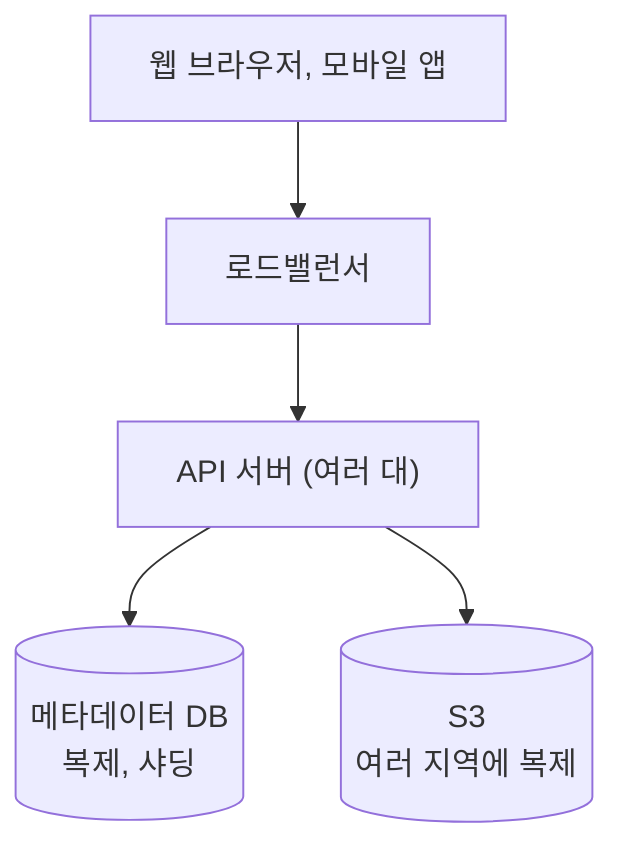

# 요구사항
---
> [!quote] 1단계 문제 이해 및 설계 범위 확정
> **지원자**: 가장 중요하게 지원해야 할 기능들은 무엇인가요?
> **면접관**: 파일 업로드/다운로드, 파일 동기화, 그리고 알림(notification)입니다.
>
> **지원자**: 모바일 앱이나 웹 앱 가운데 하나만 지원하면 되나요, 아니면 둘 다 지원해야 합니까?
> **면접관**: 둘 다 지원해야 합니다.
>
> **지원자**: 파일을 암호화해야 할까요?
> **면접관**: 네.
>
> **지원자**: 파일 크기에 제한이 있습니까?
> **면접관**: 10GB 제한이 있습니다.
>
> **지원자**: 사용자는 얼마나 됩니까?
> **면접관**: 일간 능동 사용자(DAU) 기준으로 천만(10Million) 명입니다.

## 기능 요구사항
1. 파일 업로드: 드래그 앤 드롭으로 파일을 추가한다. 파일 하나는 최대 10GB.
2. 파일 다운로드
3. 여러 단말 동기화: 한 단말에서 파일을 추가하거나 고치면 다른 단말에도 자동으로 반영된다.
4. 파일 갱신 이력 조회 (revision history)
5. 파일 공유
6. 알림: 파일이 편집, 삭제, 공유되면 관련 사용자에게 알린다.
7. 지원 단말: 웹, 모바일 앱
8. 파일 암호화

제외: 구글 문서처럼 여러 사람이 한 문서를 동시에 편집하는 기능

## 비기능 요구사항
1. 안정성: 데이터를 절대 잃어버리면 안 된다.
	- 내구성. 서버나 데이터센터가 통째로 날아가도(DR) 복구할 수 있게 하라는 것
2. 빠른 동기화: 동기화가 느리면 사용자가 떠난다.
3. 네트워크 대역폭 절약: 모바일 데이터 요금제를 쓰는 사용자에게 특히 중요하다.
	- 파일을 통째로 주고받지 말라는 것. 
4. 규모 확장성: 트래픽이 아주 많아도 처리할 수 있어야 한다.
	- 서버만 늘리면 버티는 구조
5. 높은 가용성: 일부 서버가 죽거나 느려지거나 네트워크 일부가 끊겨도 계속 쓸 수 있어야 한다.
	- 서비스가 멈추지 않게 하라는 것. 한 대가 죽어도 다른 대가 이어받도록 모든 구성 요소를 이중화하고 장애 조치(failover)를 자동으로 한다.

### 규모
| 항목      | 값                                     |
| ------- | ------------------------------------- |
| 사용자     | 가입 5천만 명, DAU 천만 명                    |
| 저장 공간   | 사용자마다 10GB, 전체 최대 500PB               |
| 업로드     | 사용자마다 하루 2개, 평균 500KB                 |
| 업로드 QPS | 천만 x 2 / 86,400초 = 약 240, 최대 480      |
| 하루 유입량  | 천만 x 2 x 500KB = 10TB (1년이면 약 3.65PB) |

500PB는 모두가 10GB를 꽉 채웠을 때의 상한이다. 실제로 쌓이는 속도는 하루 10TB 정도다.

# 라이브 코테에서 던질 질문
---
> [!question]- 질문 목록 (눌러서 펼치기)
> 요구사항은 면접관에게 질문해서 확정한다. 책의 대화에 나온 질문 5개는 기본으로 하고, 아래 질문을 더한다. 답에 따라 설계가 달라지는 질문부터 하고, 순서는 기능 범위 → 규모 → 품질이 무난하다.
>
> ### 기능 범위
> | 질문                                   | 답에 따라 달라지는 것                                                            |
> | ------------------------------------ | ----------------------------------------------------------------------- |
> | 데스크톱 동기화 폴더까지 만드나요, 웹에서 올리고 받기만 하나요? | 동기화가 필요하면 블록 분할, 알림, 충돌 처리가 모두 들어온다. 설계의 절반이 이 답에 달려 있다.                |
> | 여러 사람이 한 파일을 동시에 고칠 수 있어야 하나요?       | 필요하면 OT나 CRDT 같은 동시 편집 기법이 필요하다. 아니면 먼저 커밋한 쪽이 이기고 나머지는 충돌 사본으로 남기면 된다. |
> | 공유는 어디까지인가요? 보기 권한과 편집 권한을 나누나요?     | 권한 모델과 공유 폴더를 메타데이터에 어떻게 담을지                                            |
> | 갱신 이력은 몇 개, 얼마나 오래 남기나요?             | 저장 비용, 오래된 버전 정리 정책, 콜드 스토리지 사용 여부                                      |
> | 검색이나 미리보기 같은 기능도 포함인가요?              | 범위를 줄이는 질문. 빠지면 그만큼 설계에 집중할 수 있다.                                       |
>
> ### 규모
> | 질문 | 답에 따라 달라지는 것 |
> |---|---|
> | 가입자와 DAU는 얼마인가요? | 서버 대수, 메타데이터 DB 샤딩 |
> | 파일의 평균 크기와 최대 크기는요? | 블록 크기, 이어 올리기 필요 여부 |
> | 사용자 한 명이 하루에 몇 개나 올리나요? | 업로드 QPS, 하루 유입량 |
> | 사용자마다 저장 공간 한도가 있나요? | 전체 저장 용량 |
> | 읽기와 쓰기 비율은 어떤가요? | 캐시 전략, 다운로드 대역폭 |
> | 주로 어떤 파일인가요? 문서인가요, 사진과 영상인가요? | 델타 동기화와 압축이 얼마나 효과가 있는지. 사진과 영상은 고칠 때 파일 전체가 바뀌는 경우가 많다. |
>
> ### 품질
> | 질문 | 답에 따라 달라지는 것 |
> |---|---|
> | 한 단말에서 고친 내용이 다른 단말에 몇 초 안에 보여야 하나요? | 알림 방식(롱 폴링, 웹소켓)과 알림 서버 구조 |
> | 같은 파일이 단말마다 잠깐 다르게 보여도 되나요? | 강한 일관성이 필요하면 메타데이터는 관계형 DB, 캐시는 쓰기 후 무효화 |
> | 모바일 데이터 절약이 중요한가요? | 클라이언트가 직접 블록을 나누고 바뀐 블록만 보내야 하는지 |
> | 암호화는 전송 구간만인가요, 저장할 때도인가요, 서버도 못 보게 해야 하나요? | 키 관리 방식, 서버 쪽 압축과 중복 제거 가능 여부 |
> | 한 지역 전체가 멈춰도 서비스해야 하나요? | 여러 지역 복제, 비용 |
> | 오프라인에서 고친 파일은 어떻게 처리하나요? | 변경 기록과 커서, 충돌 처리 규칙 |

# 개발
---
#### 들어가기전에 질문
> [!question] S3를 사용하면서 왜 presigned url 을 사용하지 않는가?

책에서는 해당 내용에 대한 언급으로 "직접 업로드" 라는 예시를 든다. 그리고 두 가지 단점을 언급한다.
1. 분할, 압축, 암호화 로직을 iOS, 안드로이드, 웹마다 따로 구현해야 한다.
2. 클라이언트는 해킹당할 수 있으니 암호화를 클라이언트에 두면 위험하다.

추가로 해당 "구글 드라이브" 챕터는 실제 구현 내용은 "드롭박스"를 거의 모방하고 있기에 그것에 편향되게 작성된 것 같다.
하지만 책에서 언급한 단점들은 전부 S3 기능이나 클라이언트 단에서 해결이 가능하지만 어느정도의 trade off가 있다. 
좀 더 자세하게 알아보고 후에 언급할 예정.

## 1. 기능 요구사항과 API
---

| API      | 예시                                   | 인자                               |
| -------- | ------------------------------------ | -------------------------------- |
| 파일 업로드   | `/files/upload?uploadType=resumable` | `uploadType`, `data`: 업로드할 로컬 파일 |
| 파일 다운로드  | `/files/download`                    | `path`: 다운로드할 파일 경로              |
| 갱신 이력 조회 | `/files/list_revisions`              | `path`, `limit`: 가져올 이력의 최대 개수   |

업로드는 두 종류
- 단순 업로드: 파일이 작을 때
- 이어 올리기(resumable upload): 파일이 크거나 네트워크가 끊길 가능성이 높을 때. 파일 하나가 최대 10GB이고 모바일도 지원해야 하니 꼭 필요하다.
이어 올리기
1. 이어 올리기용 URL을 받는 최초 요청을 보낸다.
2. 데이터를 올리면서 업로드 상태를 확인한다.
3. 중간에 끊기면 끊긴 지점부터 다시 올린다.

> [!note]- 보충: 실제 구글 드라이브의 이어 올리기
> 서버가 업로드 세션마다 지금까지 받은 바이트를 기억하고, 클라이언트는 끊기면 어디까지 받았는지 물어본 뒤 그다음부터 이어 올린다.
>
> 1. 세션 시작: 파일 이름과 전체 크기를 보내면 이 업로드에만 쓰는 세션 URL을 받는다. 일주일 동안 유효하다.
> 2. 내용 보내기: 세션 URL로 내용을 한 번에 또는 나눠서 보낸다.
> 3. 끊기면: 세션 URL에 어디까지 받았는지 묻는다. 서버가 `308 Resume Incomplete`와 받은 범위(`Range`)를 알려 주면 그다음 바이트부터 보낸다.
>
> - 재시도는 앱이 알아서 한다. 사용자는 진행률이 잠깐 멈췄다가 다시 오르는 것만 본다.
> - 사용자가 취소하고 다시 올리면 새 세션이라 처음부터 올라간다. 서버는 같은 파일인지 모르고 세션 URL로만 구분한다.
> - 세션은 바이트 위치만 기억하고 내용은 모른다. 끊긴 사이에 파일이 바뀌었는지는 클라이언트가 확인해야 한다.
> - 세션 URL은 presigned URL처럼 업로드 하나에만 쓰지만, 받는 곳은 저장소가 아니라 구글의 업로드 서버다. 항상 구글 서버를 거친다.
> - 단순 업로드와 이어 올리기를 나누는 기준은 5MB다.
>
> 파일을 블록으로 쪼개면 기준이 세션이 아니라 블록 해시가 된다. 취소하고 다시 올려도 이미 올라간 블록은 건너뛴다.

| 기능 요구사항          | 해결하는 곳                                          |
| ---------------- | ----------------------------------------------- |
| 파일 업로드 (최대 10GB) | 업로드 API, 이어 올리기                                 |
| 파일 다운로드          | 다운로드 API                                        |
| 여러 단말 동기화        | API 없음. 알림 서비스와 다운로드 절차                    |
| 파일 갱신 이력 조회      | 갱신 이력 API, 버전 테이블                          |
| 파일 공유            | API 없음. 공유 폴더 여부(`namespace.is_shared`)만 관리 |
| 알림               | API 없음. 알림 서비스                             |
| 웹, 모바일 앱 지원      | 같은 HTTP API를 함께 쓴다                              |
| 파일 암호화           | 전송은 HTTPS, 저장은 블록 저장소 서버에서 암호화             |

> [!note]- 보충: 경로 대신 파일 ID
> 다운로드 API와 갱신 이력 API의 `path`는 내 컴퓨터의 로컬 경로가 아니라 드라이브 안에서의 경로다(`/recipes/soup/best_soup.txt`). 업로드할 때는 `data`로 파일 내용만 보내므로 서버는 로컬 경로를 알 필요가 없다.
>
> 실제 구글 드라이브 API는 경로 대신, 업로드할 때 서버가 붙여 준 `fileId`로 파일을 찾는다(`GET /drive/v3/files/{fileId}?alt=media`).
>
> | 파일을 `/archive/`로 옮기면 | 경로로 찾을 때 | ID로 찾을 때 |
> | --- | --- | --- |
> | 파일을 찾는 값 | 바뀐다 | 그대로 |
> | 공유받은 사람의 링크 | 옛 경로를 가리켜서 깨진다 | 그대로 열린다 |
> | 옛 경로로 이력 조회 | 파일을 못 찾는다 | 그대로 나온다 |
>
> ID로 찾으면 옮기기와 이름 바꾸기는 파일의 부모 폴더와 이름 값만 바꾸는 일이 되고, 이력과 공유 설정은 ID에 붙어서 그대로 따라간다. 게다가 구글 드라이브는 같은 폴더에 이름이 같은 파일을 여러 개 둘 수 있어서, 경로만으로는 파일이 하나로 정해지지도 않는다.

## 2. 서버 한 대에서 출발해 메타데이터와 파일 내용 나누기
---

처음에는 서버 한 대에 모든 걸 둔다.
- 웹 서버(아파치): 업로드, 다운로드 처리
- DB(MySQL): 사용자, 로그인 정보, 파일 정보 같은 메타데이터
- 디스크(1TB): `/drive/` 아래에 사용자마다 namespace 디렉터리를 두고 올린 파일을 그대로 저장한다. namespace와 상대 경로를 합치면 파일이 하나로 정해진다.

서버 한 대의 문제를 하나씩 풀다 보면 역할별로 나뉜다.

| 문제 | 해결 |
| --- | --- |
| 디스크가 가득 찬다 (1TB 중 10MB 남음) | `user_id % 4`로 샤딩해 여러 서버에 나눈다 |
| 서버가 죽으면 파일을 잃는다 | 파일은 S3에 두고 여러 지역에 복제한다 |
| 트래픽이 몰리거나 서버 한 대가 죽는다 | 로드밸런서를 두고 API 서버를 늘린다. API 서버는 상태가 없어서 늘리기 쉽다 |
| DB가 파일 서버와 함께 죽는다 (SPOF) | 메타데이터 DB를 따로 떼어 내 복제하고 샤딩한다 |

여기서 핵심은 파일 하나가 두 군데에 나뉘어 저장된다는 점이다.

| 구분 | 메타데이터 DB | S3 |
| --- | --- | --- |
| 담는 것 | 이름, 경로, 최신 버전 같은 파일 정보 | 파일 내용 |
| 크기 | 파일마다 수백 바이트 | 파일 크기만큼 |
| 바뀌는 방식 | 고칠 때마다 갱신 | 덮어쓰지 않고 새 버전을 추가 |
| 일관성 | 강한 일관성 필요 | 덮어쓰지 않으니 옛 내용과 새 내용이 섞이지 않는다 |

그래서 "파일이 바뀌었다"는 메타데이터의 최신 버전 한 줄을 고치는 일이 되고, 강한 일관성은 메타데이터에만 걸면 된다. 같은 파일이 단말마다 다르게 보이면 안 되기 때문이다.
- DB: ACID를 지원하는 관계형 DB를 쓴다. NoSQL은 이를 기본으로 지원하지 않아 동기화 로직에 직접 넣어야 한다.
- 캐시: 메모리 캐시는 보통 최종 일관성이다. 캐시 사본과 DB 원본이 일치해야 하고, DB가 바뀌면 캐시 사본을 무효화한다.

> [!note]- 보충: 캐시 무효화 순서
> DB를 먼저 갱신하고 그다음 캐시 항목을 지운다. 캐시를 먼저 지우면, 지운 직후 DB가 아직 옛 값일 때 들어온 읽기 요청이 옛 값을 읽어 캐시에 다시 넣는다. 그러면 DB는 새 값인데 캐시는 옛 값인 상태가 다음 무효화 때까지 남는다.
>
> 이 순서도 드물게 어긋날 수 있어서 캐시 항목에 짧은 만료 시간(TTL)을 같이 둔다.

> [!note]- 보충: S3 복제
> S3는 한 지역 안에서도 이미 가용 영역(AZ) 세 곳 이상에 나눠 저장한다. 서버나 데이터센터 하나가 죽는 정도로는 파일을 잃지 않는다. 여러 지역 복제(CRR)는 지역 전체가 멈추는 경우를 대비한 것이다.
> - 비동기라 복제본이 늦을 수 있다. 보통 15분 안에 끝나지만 보장은 없고, 복제 시간 보장 옵션(RTC)을 쓰면 99.99%를 15분 안에 복제한다고 보장한다.
> - 저장 비용이 지역 수만큼 늘고, 지역 간 전송 비용도 든다.
